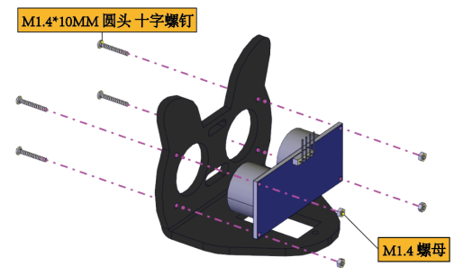
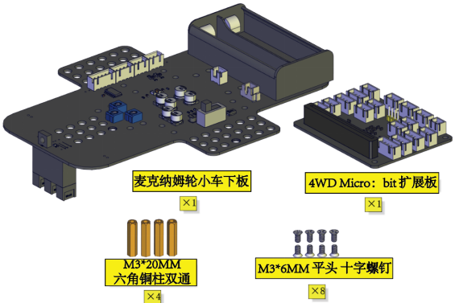
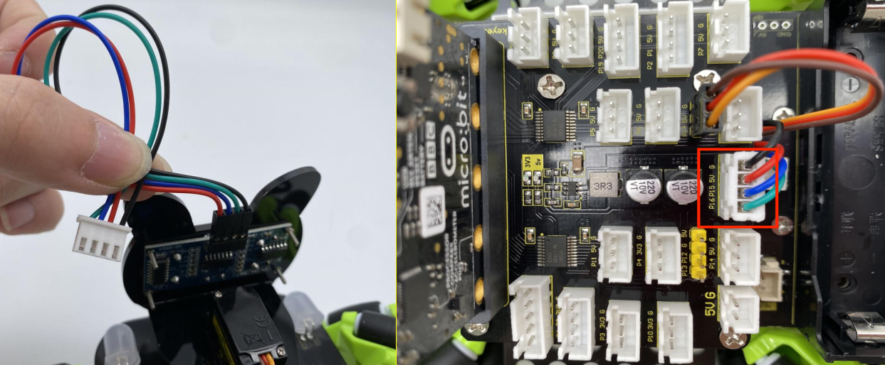
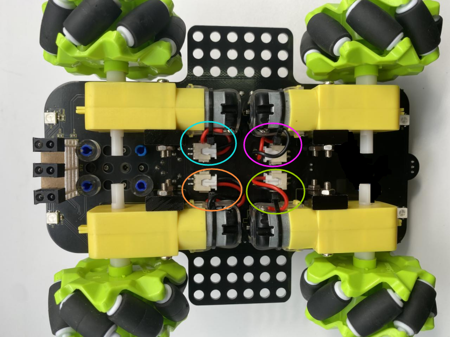

## 4WD Microbit麦克纳姆轮智能小车的安装步骤

安装1

安装所需零件:

安装:

完成:

安装2

安装所需零件:

安装:

完成:

安装3

安装所需零件：

安装：

完成：

安装4

**舵机初始化：**

安装前需要先设置舵机角度为90°。设置舵机角度时，将舵机连接在Microbit扩展板的G、V、P14，在Microbit主控板上上传对应代码，外接电源供电后，按下Microbit主控板上的复位按键，舵机就转到90°的位置。

| 舵机 | Microbit扩展板 |
| :--: | :--: |
| 棕线 | G |
| 红线 | V |
| 橙线 | P14 |

我们提供的舵机初始化角度的代码位置如下图：

安装所需零件：

安装：

(注意安装方向)

完成：

安装5

安装所需零件：

安装：

完成：

安装6

安装所需零件：

安装：

完成：

安装7

安装所需零件：

安装：

（注意电机安装方向，线材方向朝内）

完成：

安装8

安装所需零件：

安装：

完成：

安装9

安装所需零件：

安装：

完成：

安装10

安装准备零件：

安装：

完成：

接线

舵机接线：

| 舵机 | Microbit扩展板 |
| :--: | :--: |
| 棕线 | G |
| 红线 | V |
| 橙线 | P14 |

超声波模块接线：

| 超声波模块 | Microbit扩展板 |
| :--: | :--: |
| Vcc | 5V|
| Trig | P15 |
| Echo | P16|
|Gnd|G|

控制红外模块接线：

| 驱动板 | Microbit扩展板 |
| :--: | :--: |
| GND | G|
| 5V | 5V |
| S5 | P0|

控制WS2812RGB接线：

| 驱动板 | Microbit扩展板 |
| :--: | :--: |
| GND | G|
| 5V | 5V |
| S4 | P7|

控制电机和七彩灯接线:

| 驱动板 | Microbit扩展板 |
| :--: | :--: |
| SCL | P19|
| SDA | P20 |
|5V | 5V|
|GND|G|

控制三路循迹模块接线:

| 驱动板 | Microbit扩展板 |
| :--: | :--: |
| S1 | P10|
| S2 | P4 |
|S3| P3|
| | |
|GND|G|

电源接线:

电机接到对应的接口上:

电池安装示范:

