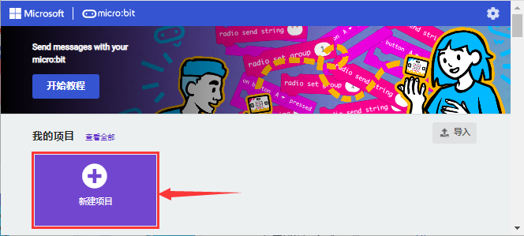
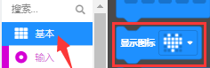
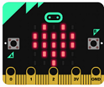

# 第01课 心跳

 Micro:bit 基础课程是使用Micro:bit主板自带的传感器模块和LED点阵。

## 1.实验说明：                                                                              
首先先来练习一个不需要其他辅助元件，只需要一块Micro:bit主板，一根Micro USB数据线与一台计算机的简单实验，让Micro:bit主板上的点阵显示“心跳”，这是一个让Micro:bit主板和计算机通信的实验，这也是一个入门实验，希望可以带领大家进入Micro:bit的魔幻世界。

## 2.准备：                                                                                    
（1）通过Micro USB线连接Micro:bit主板和电脑。

（2）打开离线版本或Web版本的MakeCode。 

如果是选择通过导入Hex文件来加载项目，请单击“导入”。(方法请参照“**开发环境设置**”文档) 

如果要一一拖动代码块，请单击“**新建项目**”。

## 3.实验代码：                                                                                
可以直接加载我们提供的程序，也可以自己通过拖动代码块来编写代码程序，操作步骤如下：
**（1）寻找代码块**

**（2）完整的代码程序**

## 4.实验结果:                                                                                 
按照之前的方式将代码下载到Micro:bit主板，Micro USB数据线不要拔下来，利用Micro USB数据线上电，Micro:bit主板上的LED点阵屏切换显示“❤”图案和“”图案，循环进行。

如果存在下载问题，请断开Micro USB线和Micro:bit主板，然后重新连接它们并重新打开MakeCode编辑器，以尝试再次下载。

