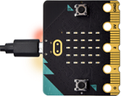
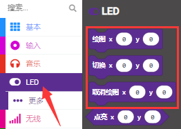
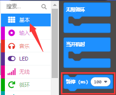
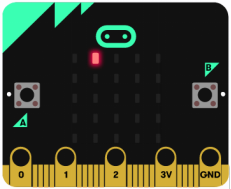

# 第02课 LED点阵中单个LED显示

## 1.实验说明：                                                                                
 Micro:bit主板的LED点阵共由25个发光二极管组成，5个一组，分别对应X和Y方向，形成一个5×5的矩阵，且每个发光二极管是放置在行线（X）和列线（Y）的交叉点上，我们可以通过设置坐标点来实现对25个LED中某一个LED的控制。例如，想要LED点阵中第1行第1个LED点亮，可以设置坐标点为（0，0）；第1行第3个LED点亮，可以设置坐标点为（2，0）；第1列第5个LED点亮，可以设置坐标点为（0，4）；第3列第2个LED点亮，可以设置坐标点为（2，1），依此类推。

## 2.准备：                                                                                    
（1）通过Micro USB线连接Micro:bit主板和电脑。

（2）打开离线版本或Web版本的MakeCode。 

如果是选择通过导入Hex文件来加载项目，请单击“导入”。(方法请参照“**开发环境设置**”文档) 

如果要一一拖动代码块，请单击“**新建项目**”。

## 3.实验代码：                                                                                
可以直接加载我们提供的程序，也可以自己通过拖动代码块来编写代码程序，操作步骤如下：
**（1）寻找代码块**

**（2）完整的代码程序：**

## 4.实验结果：                                                                               
按照之前的方式将代码下载到Micro:bit主板，Micro USB数据线不要拔下来，利用Micro USB数据线上电，我们就可以看到切换坐标点(1,0)的LED的亮灭状态，持续0.5s，再次切换坐标点(1,0)的LED的亮灭状态，持续0.5s；点亮坐标点(3,4)的LED，持续0.5s，熄灭坐标点(3,4)的LED，持续0.5s。循环进行。

