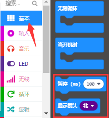
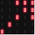

# 第03课 5 x 5 LED点阵图案显示

## 1.实验说明：                                                                                
点阵在我们生活中很常见，很多都有用到它，比如LED广告显示屏，电梯显示楼层，公交车报站等等。
Micro:bit主板的LED点阵共由25个发光二极管组成，上一课我们已经讲过通过设置坐标点来实现对LED点阵的25个LED中的某个LED的控制，这样可以通过设置多个坐标点控制多个LED的亮灭使得LED点阵能够显示图案、数字、字符串。我们也可以在特定代码中通过点击 LED点阵的灰白色小正方形点亮 LED点阵对应的LED来实现LED点阵显示图案、数字、字符串。除了上述方法还可以使用自定义图案使LED点阵显示图案。

## 2.准备：                                                                                    
（1）通过Micro USB线连接Micro:bit主板和电脑。

（2）打开离线版本或Web版本的MakeCode。 

如果是选择通过导入Hex文件来加载项目，请单击“导入”。(方法请参照“**开发环境设置**”文档) 

如果要一一拖动代码块，请单击“**新建项目**”。

## 3.实验程序1：                                                                               
可以直接加载我们提供的程序，也可以自己通过拖动代码块来编写代码程序，操作步骤如下：
**（1）寻找代码块**

**（2）完整的代码程序：**

## 4.实验结果1：                                                                               
按照之前的方式将代码1下载到Micro:bit主板，Micro USB数据线不要拔下来，利用Micro USB数据线上电，我们就可以看到Micro:bit主板的5×5 LED点阵显示“向下”图案。

## 5.实验程序2：                                                                               
可以直接加载我们提供的程序，也可以自己通过拖动代码块来编写代码程序，操作步骤如下：
**（1）寻找代码块**

**（2）完整的代码程序**

## 6.实验结果2：                                                                              
用同样的方法将代码2下载到Micro:bit主板，Micro USB数据线不要拔下来，利用Micro USB数据线上电，我们就可以看到Micro:bit主板的5×5 LED点阵开始显示数字1、2、3、4、5，然后循环显示“向下”图案、字符串“Hello!”、“心”图案、“东北”方向图案、“东南”方向图案、“西南”方向图案和“西北”方向图案。 
