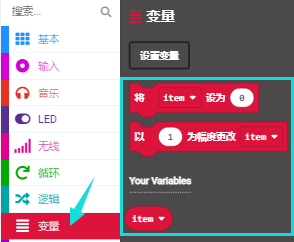

# 第04课 可编程按键

## 1.实验说明：                                                                         
      
按键可以控制电路的通断，把按键接入电路中，不按下按键的时候电路是断开的，一按下按键电路就通啦，但是松开之后就又断了。可是为什么按下才通电呢？这得从按键的内部构造说起。没按下之前，电流从按键的一端过不去另一端，按键的两端就像两座山，中间隔着一条河，我们在这座山过不去另一座山；按下的时候，按键内部的金属片把两边连接起来让电流通过，就像搭了一座桥，把两座山连接起来。
按键内部结构如图：，未按下按键之前，1、2就是导通的，3、4也是导通的，但是1、3或1、4或2、3或2、4是断开（不通）的；只有按下按键时，1、3或1、4或2、3或2、4才是导通的。
Micro:bit主板有三个按键，反面的是复位按钮，正面的是两个可编程按键，通过对两个可编程按键组合可以有三种组合，作为输入元件。我们结合上节课的LED点阵，一起来学习按键吧。我们做一个按键三连，分别按A、B和AB同时按，对应显示屏分别显示A、B和AB。

## 2.准备：                                                                                    
（1）通过Micro USB线连接Micro:bit主板和电脑。

（2）打开离线版本或Web版本的MakeCode。 

如果是选择通过导入Hex文件来加载项目，请单击“导入”。(方法请参照“**开发环境设置**”文档) 

如果要一一拖动代码块，请单击“**新建项目**”。

## 3.实验程序1：                                                                                   
按下Micro:bit主板上的按键A，按键B和按键A+B，让Micro:bit上LED点阵显示字符串。

可以直接加载我们提供的程序，也可以自己通过拖动程序块来编写程序程序，操作步骤如下：

**（1）寻找代码块**

**（2）完整的程序程序**              

## 4.实验结果1：                                                                               
按照之前的方式将程序1下载到Micro:bit主板，Micro USB数据线不要拔下来，利用Micro USB数据线上电，按下Micro:bit主板上按键A，我们可以看到5×5 LED点阵显示字符“A”；按下Micro:bit主板上按键B，我们可以看到5×5 LED点阵显示字符“B”，同时按下Micro:bit主板上按键A+B，我们就可以看到5×5 LED点阵显示字符“AB”。

## 5.实验程序2：                                                                               
按下Micro:bit主板上按键A和按键B，对应的增加和减少条形图高度，表现为LED点阵亮的行数对应的增加和减少。

可以直接加载我们提供的程序，也可以自己通过拖动代码块来编写代码程序，操作步骤如下：
**（1）创建变量item**

**（2）寻找代码块**

**（3）完整的代码程序**

## 6.实验结果2：                                                                              
用同样的方式将程序2下载到Micro:bit主板，Micro USB数据线不要拔下来，利用Micro USB数据线上电，按下Micro:bit主板主板上按键A，条形图高度值增加5，表现为LED点阵亮的行数增加；按下按键B，减少条形图高度，表现为LED点阵亮的行数减少。

