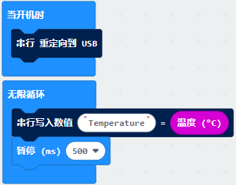
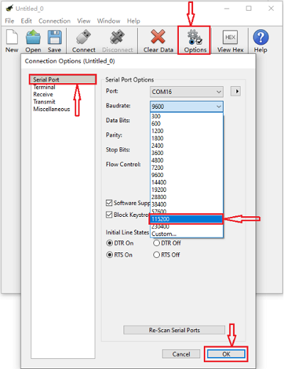

# 第05课 学习测温度

## 1.实验说明：                                                                               
Micro:bit主板实际上并不带温度传感器，而是采用nRF52833芯片内置的温度传感器进行温度检测，所以检测的温度更接近芯片的温度，可能与周围环境温度存在一定的误差。在这一课程中，我们先利用该传感器测试当前环境中的温度，并将测试结果在显示数据(设备)中显示，再通过设置该传感器检测的温度范围来控制LED点阵显示不同的图案。

注意：Micro:bit主板的温度传感器在这里：

## 2.准备：                                                                                    
（1）通过Micro USB线连接Micro:bit主板和电脑。

（2）打开离线版本或Web版本的MakeCode。 

如果是选择通过导入Hex文件来加载项目，请单击“导入”。(方法请参照“**开发环境设置**”文档) 

如果要一一拖动代码块，请单击“**新建项目**”。

## 3.实验程序1：                                                                              
Micro:bit检测温度

可以直接加载我们提供的程序，也可以自己通过拖动程序块来编写程序程序，操作步骤如下：
**（1）寻找代码块**

**（2）完整代码程序**

## 4.实验结果1:                                                                                  
按照之前的方式将程序1下载至Micro: bit主板，Micro USB数据线不要拔下来，利用Micro USB数据线上电。
打开CoolTerm 软件，点击Options，选择串行Port，设置COM口和波特率，波特率设置为115200（经过测试，Micro:bit的USB串口通讯波特率是115200），点击OK后，最后点击Connect。CoolTerm的串口监视器显示当前环境中的温度值，如下图：

## 5.实验程序2：                                                                               
通过温度控制Micro:bit主板上点阵显示不同图案（注意：程序中的温度值可以根据当地环境适当的调整）

可以直接加载我们提供的程序，也可以自己通过拖动程序块来编写程序程序，操作步骤如下：（这里设置的温度值可以根据实际情况重新设置）
**（1）寻找代码块**

**（2）完整的代码程序**

## 6.实验结果2：                                                                                
按照之前的方式将程序2下载到Micro:bit主板，Micro USB数据线不要拔下来，利用Micro USB数据线上电，外界环境中的温度小于35℃时，Micro:bit主板的5×5LED点阵中显示图案，用手按住Micro:bit主板的温度传感器，温度大于等于35℃时，5×5LED点阵中显示图案。