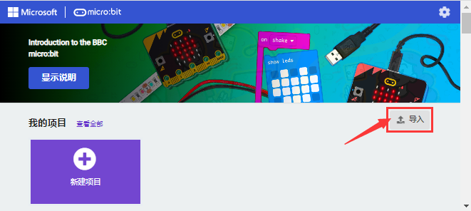
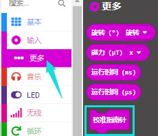
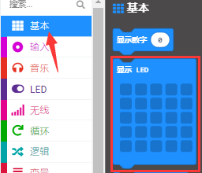
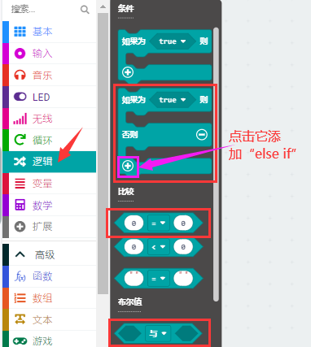
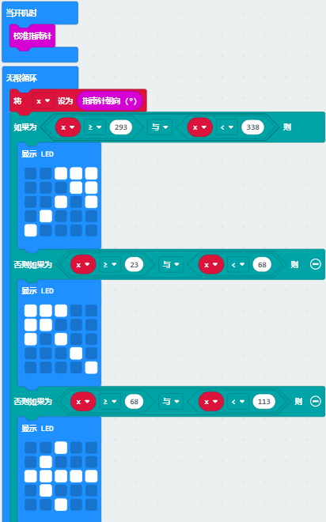
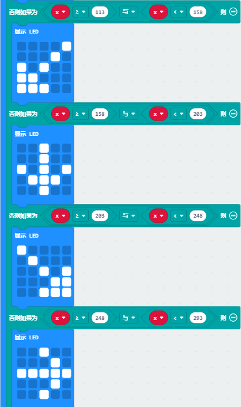

# 第06课 地磁传感器

## 1.实验说明：                                                                                
本实验项目主要介绍Micro:bit地磁传感器的使用，地磁传感器除了检测地磁场强度外，还能当作指南针确定方向，同时也是航姿参考系统(AHRS)的重要组成部分。Micro:bit V2主板采用的是LSM303AGR 地磁传感器，磁场动态范围为±50 gauss。在micro:bit V2主板中，磁力检测、指南针积木块均用到了磁力计栏，本实验中，将先介绍指南针，然后查看磁力计原始数据。常见的指南针主要部件是一根磁针，在地磁场的作用下可以转动并指向地磁北极（地磁北极是在地理南极附近），用来辨别方向。
micro:bit内部的一个地磁传感器（磁力计、指南针），我们可以读取这个磁力计的读数来判断方位，得到相对于北磁极的数值。返回值是0到360之间的数值，在磁力计首次开始工作（带到新位置后）时系统会自动要求我们对micro:bit主板校准，正确的校准方式是旋转micro:bit主板。需要注意的是，附近要是有金属物件可能会影响读数和校准准确性。

## 2.准备：                                                                                    
（1）通过Micro USB线连接Micro:bit主板和电脑。

（2）打开离线版本或Web版本的MakeCode。 

如果是选择通过导入Hex文件来加载项目，请单击“导入”。(方法请参照“**开发环境设置**”文档) 

如果要一一拖动代码块，请单击“**新建项目**”。

## 3.实验程序1：                                                                              
按下按键A的时候，可以在屏幕上显示磁力计的读数。

可以直接加载我们提供的程序，也可以自己通过拖动程序块来编写程序程序，操作步骤如下：
**（1）寻找代码块**

**（2）完整代码程序**

程序说明：首先必须对Micro:bit进行校准，因为每个地方地磁场不同，对结果有比较大的的影响，如果是第一次使用指南针，Micro:bit会自动提示需要校准。

## 4.实验结果1:                                                                                 
按照之前的方式将程序1下载至Micro: bit主板，micro USB数据线不要拔下来，利用Micro USB数据线上电，按下Micro:bit主板上正面按键A时，Micro:bit主板首先提示校准，屏幕(LED点阵)提示:“TILT TO FILL SCREEN”,然后进入校准界面，校准方式为：旋转Micro:bit主板，使得屏幕(LED点阵)画一个封闭的正方形（25个LED都点亮），如下图所示：

当封闭的正方形画好后，会显示一个“笑脸”图案，表示校准完成。
校准完成后，当每次按下按键A的时候，直接在屏幕上显示磁力计读数，北、东、南、西对应0°、90°、180°、270°。

## 5.实验程序2：                                                                               
朝不同的方向旋转磁力计，LED点阵显示对应的方向图案。

该代码块是可以持续磁力计的读数来确定方向，并让箭头指向当前的磁北极。

如上图所示，如果读数在292.5和337.5之间，就让显示屏显示一个指向右上方的箭头，由于程序里不能输入0.5，所以取的判断数值是293和338。之后再加入其它逻辑判断条件，就得到了完整的程序。

可以直接加载我们提供的程序，也可以自己通过拖动程序块来编写程序程序，操作步骤如下：
**（1）寻找代码块**

**（2）完整的代码程序**

## 6.实验结果2：                                                                                
按照之前的方式将程序2下载到Micro:bit主板，Micro USB数据线不要拔下来，利用Micro USB数据线上电，提示校准（校准方法请参考:上面程序1部分），校准完成后，旋转移动Micro:bit主板，可以看到Micro:bit主板上LED点阵显示各方向图案。

