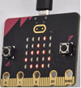
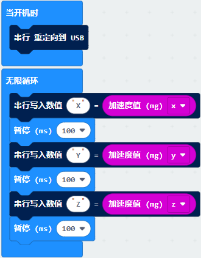

# 第07课 加速度传感器

## 1.实验说明：                                                                              
Micro:bit V2主板内置有LSM303AGR 重力加速度传感器（加速度计），其具有8/10/12 bits的分辨率，程序可设置量程为1g、2g、4g,、8g。
我们常使用加速度计来检测机器的姿态。
在本实验项目中，将介绍加速度传感器（加速度计）对几个特殊姿态的检测，之后来查看加速度传感器输出的三轴原始数据。

## 2.准备：                                                                                    
（1）通过Micro USB线连接Micro:bit主板和电脑。

（2）打开离线版本或Web版本的MakeCode。 

如果是选择通过导入Hex文件来加载项目，请单击“导入”。(方法请参照“**开发环境设置**”文档) 

如果要一一拖动代码块，请单击“**新建项目**”。

## 3.实验程序1：                                                                              
对Micro:bit不同的操作，LED点阵显示对应的数字。

可以直接加载我们提供的程序，也可以自己通过拖动程序块来编写程序，操作步骤如下：
**（1）寻找代码块**

**（2）完整代码程序**

## 4.实验结果1:                                                                                  
按照之前的方式将程序1下载到Micro:bit主板，利用Micro USB数据线上电，将Micro:bit主板晃动，则可见Micro:bit显示数字1（表明只要有晃动，无论朝哪个方向晃动，该条件都将满足）。

当Micro:bit主板的Logo朝上时，LED点阵显示数字2，Logo朝上示意图如下所示：

同理，Micro:bit主板的Logo朝上时，LED点阵显示数字3(倒立的3)，Logo朝下示意图如下所示：

当屏幕朝上（指的是LED点阵朝上）时，LED点阵显示数字4。如下图所示：

同理，当屏幕朝下（指的是LED点阵朝下）时，LED点阵显示数字5。

当Micro:bit 主板向左倾斜（是指LED点阵先朝上，然后再往左边倾斜）时，LED点阵显示数字6。如下图所示：

同理，当Micro:bit主板向右倾斜（是指LED点阵先朝上，然后再往右边倾斜）时，LED点阵显示数字7。如下图所示：

当不小心碰到Micro:bit主板使其从桌面掉落，则为做自由落体运动，此时，Micro:bit主板满足自由落体的条件，则LED点阵显示数字8。（注意：此方法操作时，很容易把micro:bit主板摔坏，不建议操作）
注意：（3g、6g、8g， 如果需要满足此条件，则需要达到3倍，6倍，8倍重力加速度甩动Micro:bit主板。如果你们有兴趣的话，这部分程序可以自己添加）

## 5.实验程序2：                                                                              
检测加速度在X轴，Y轴，Z轴的不同的值

可以直接加载我们提供的程序，也可以自己通过拖动程序块来编写程序，操作步骤如下：
**（1）寻找代码块**

**（2）完整的代码程序**

## 6.实验结果2：                                                                               
按照之前的方式将程序2下载到Micro:bit主板，Micro USB数据线不要拔下来，利用Micro USB数据线上电。
打开CoolTerm，点击Options，选择串行Port，设置COM口和波特率，波特率设置为115200（经过测试，Micro:bit的USB串口通讯波特率是115200），点击OK后，最后点击Connect。CoolTerm串口监视器分别显示了加速度在X轴、Y轴、Z轴的分解，以及加速度的合成(重力加速度及其它外力作用的加速度合成)，先将加速计Z轴朝上，然后再将加速计X轴朝上，最后将加速计Z轴朝上,可得数据变化如下图：

