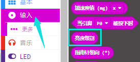
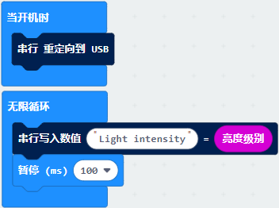

# 第08课 光照强度检测

1.实验说明：                                                                               
本实验将介绍Micro:bit对外界光照强度的检测，由于Micro:bit并不自带光敏传感器，对外界光照强度的检测是通过LED矩阵进行的，LED矩阵被用来感知周围的光，并反复地将LED转换成输入，并采样电压衰减时间。这样检测出来的光照强度是一个相对值。

## 2.准备：                                                                                    
（1）通过Micro USB线连接Micro:bit主板和电脑。

（2）打开离线版本或Web版本的MakeCode。 

如果是选择通过导入Hex文件来加载项目，请单击“导入”。(方法请参照“**开发环境设置**”文档) 

如果要一一拖动代码块，请单击“**新建项目**”。

## 3.实验程序：                                                                               
可以直接加载我们提供的程序，也可以自己通过拖动程序块来编写程序，操作步骤如下：
**（1）寻找代码块**

**（2）完整代码程序**

## 4.实验结果：                                                                                
按照之前的方式将代码下载到Micro:bit主板，Micro USB数据线不要拔下来，利用Micro USB数据线上电。

打开CoolTerm，点击Options，选择串行Port，设置COM口和波特率，波特率设置为115200（经过测试，micro:bit的USB串口通讯波特率是115200），点击OK后，最后点击Connect。这样，CoolTerm串口监视器显示光线亮度级别值。

