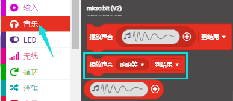

# 第09课 扬声器

## 1.实验说明：                                                                                
Micro:bit主板有内置扬声器，这使得在你的项目中添加声音变得非常容易。通过编程使扬声器发出各种各样的音调，例如编写一首歌曲：《欢乐颂》，让扬声器播放出来。

## 2.准备：                                                                                    
（1）通过Micro USB线连接Micro:bit主板和电脑。

（2）打开离线版本或Web版本的MakeCode。 

如果是选择通过导入Hex文件来加载项目，请单击“导入”。(方法请参照“**开发环境设置**”文档) 

如果要一一拖动代码块，请单击“**新建项目**”。

## 3.实验程序1：                                                           
发出声音

可以直接加载我们提供的程序，也可以自己通过拖动程序块来编写程序，操作步骤如下：
**（1）寻找代码块**

**（2）完整代码程序**

## 4.实验现象1:                                                                                   
按照之前的方式将实验程序2下载到Micro:bit主板，利用Micro USB数据线上电，Micro:bit主板上的扬声器发出声音且LED点阵显示音乐标志图案。

## 5.实验程序2：                                                                          
演奏一首《欢乐颂》歌曲

歌曲《欢乐颂》的简谱如下：

更多音乐简谱知识的相关链接：https://en.wikipedia.org/wiki/`Numbered_musical_notation

可以直接加载我们提供的程序，也可以自己通过拖动程序块来编写程序，操作步骤如下：
**（1）寻找代码块**

**（2）完整代码程序**

## 6.实验现象2:                                                                                   
按照之前的方式将实验程序2下载到Micro:bit主板，利用Micro USB数据线上电，Micro:bit主板上的扬声器播放一首《欢乐颂》歌曲。

