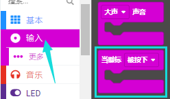
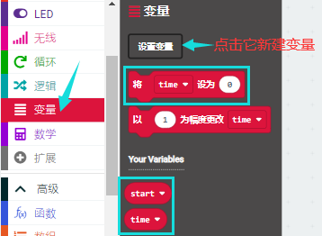
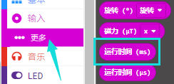
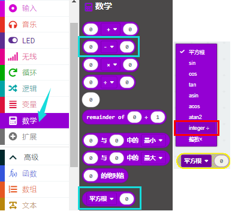
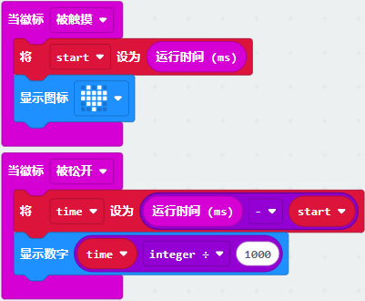

# 第10课 触摸感应logo

## 1.实验说明：                                                                                
如果你有了Micro:bit主板，你可以在你的项目中使用金色的触摸感应logo作为另一个输入，这就像多了一个按钮。触摸感应采用的是电容式触摸传感器，当你手指按下（或触摸）它时，它就能感应到电场的微小变化----就像你的手机或平板电脑屏幕一样。当你触摸它，能控制Micro:bit板实现某个功能。

## 2.准备：                                                                                    
（1）通过Micro USB线连接Micro:bit主板和电脑。

（2）打开离线版本或Web版本的MakeCode。 

如果是选择通过导入Hex文件来加载项目，请单击“导入”。(方法请参照“**开发环境设置**”文档) 

如果要一一拖动代码块，请单击“**新建项目**”。

## 3.实验代码：                                                                              
可以直接加载我们提供的程序，也可以自己通过拖动程序块来编写程序，操作步骤如下：
**（1）寻找代码块**

**（2）完整代码程序**

## 4.实验现象：                                                                                  
按照之前的方式将实验代码下载到Micro:bit板，利用Micro USB数据线上电，手指按住Micro:bit主板上“Logo”标志处，Micro:bit主板上的LED点阵显示“❤”图案；手指松开Micro:bit主板上“Logo”标志处，会出现数字。

