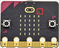
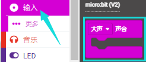
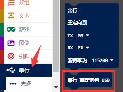
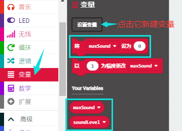
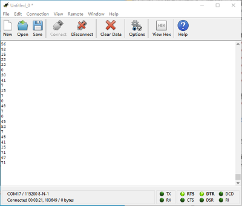

# 第11课 麦克风

## 1.实验说明：                                                                                 
Micro:bit 主板有一个内置麦克风，可以测量环境的声音程度。你可以使用它作为一个简单的输入---当你鼓掌时，Micro:bit主板上前面内置麦克风LED指示灯会被打开。它还可以测量声音的强度，所以你可以制作一个噪音等级表或与音乐合拍的迪斯科灯光。麦克风是在Micro:bit 主板的背面，而在前面，你会发现一个内置麦克风LED指示灯，还有紧挨着让声音进入麦克风的孔。当你Micro:bit主板在测量声音级别时，它就会亮起来。

## 2.准备：                                                                                    
（1）通过Micro USB线连接Micro:bit主板和电脑。

（2）打开离线版本或Web版本的MakeCode。 

如果是选择通过导入Hex文件来加载项目，请单击“导入”。(方法请参照“**开发环境设置**”文档) 

如果要一一拖动代码块，请单击“**新建项目**”。

## 3.实验程序1：                                                                              
可以直接加载我们提供的程序，也可以自己通过拖动程序块来编写程序，操作步骤如下：
**（1）寻找代码块**

**（2）完整代码程序**

## 4.实验结果1:                                                                                
按照之前的方式将实验程序1下载到Micro:bit板，利用Micro USB数据线上电，当你鼓掌时，Micro:bit 主板上的LED点阵显示“❤”图案；当外界环境安静时，Micro:bit 主板上的LED点阵显示“”图案。

## 5.实验程序2：                                                                                  
可以直接加载我们提供的程序，也可以自己通过拖动程序块来编写程序，操作步骤如下：
**（1）寻找代码块**

**（2）完整代码程序**

## 6.实验结果2：                                                                               
按照之前的方式将实验程序2下载到Micro:bit主板，利用Micro USB数据线上电。
打开CoolTerm，点击Options，选择串行Port，设置COM口和波特率，波特率设置为115200（经过测试，Micro:bit的USB串口通讯波特率是115200），点击OK后，最后点击Connect。CoolTerm串口监视器显示了声音强度值。

