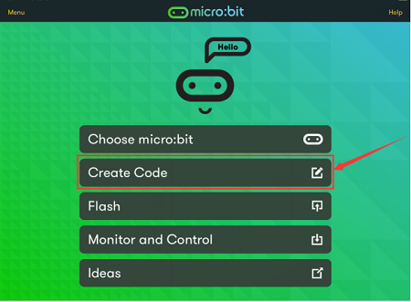
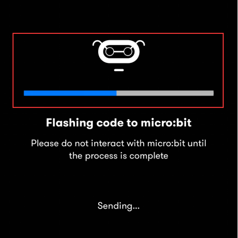

# 第12课 Microbit 蓝牙无线通信

## 1.实验说明：                                                                                
Micro:bit主板了处理器内置蓝牙5.1低功耗的BLE(蓝牙 Low Energy)设备）以及2.4GHz天线，可进行蓝牙无线通信和2.4GHz无线通信。使得Micro:bit主板可以与各种蓝牙设备进行通信，包括智能手机和平板电脑。

在本实验中，主要讲解新款的Micro:bit主板实现蓝牙无线通信功能，我们可以通过连接蓝牙，实现无线传输代码（信号）功能。我们利用一个苹果系统设备（手机/iPad）和Micro:bit 主板连接，实现无线传输功能。设置安卓系统手机实现无线传输方法和苹果系统设备（手机/iPad）类似，这里就不一一介绍了。

## 2.准备：                                                                                    
（1）通过Micro USB线连接Micro:bit主板和电脑。

（2）苹果系统设备（手机/iPad）或安卓系统手机。

## 3.实验步骤：                                                                                
App下载链接：[https://microbit.org/get-started/user-guide/mobile/](https://microbit.org/get-started/user-guide/mobile/) （安卓系统下载参考链接）

我们以苹果系统设备为例：

（1）如果你的智能手机/iPad是苹果系统的，需要先在电脑上进入网页：[https://www.microbit.org/get-started/user-guide/ble-ios/](https://www.microbit.org/get-started/user-guide/ble-ios/) ，往下翻点击 “Download pairing HEX file”下载micro:bit的固件到创建的文件夹中或电脑桌面上，并将下载好的Micro:bit固件烧入Micro:bit主板中。（这一步只针对于苹果系统的智能手机/iPad，安卓系统智能手机/不需要这一步）

（2）在苹果系统设备（手机/iPad）上打开，在App Store的搜索框中输入“micro bit”，然后选中micro:bit 选项，会出现下载界面（如下图所示：），点击“”，就可以下载安装对应的APP。

（3）苹果系统设备（手机/iPad）和Micro:bit主板配对连接。

a.APP安装成功后，打开苹果系统设备（手机/iPad）上的蓝牙。

b.点击打开APP，先确定Micro USB数据线已经将Micro:bit主板和电脑连接上，再点击APP的第一项“**Choose micro:bit**”，开始配对蓝牙。

c.点击“**Pair a new micro:bit**”，开始配对。

d.根据提示，首先同时按住micro:bit主板上的按键A和B，然后按下micro:bit主板后面的复位&电源按钮几秒钟（按键A和B不能松开），再松开复位&电源按钮，micro:bit主板上LED点阵会显示一个密码图案。最后松开micro:bit主板上的按键A和B，接着点击“**Next**”。

e.在苹果系统手机/iPad上设置密码图案，使图案和micro:bit主板上显示的密码图案一样，点击“**Next**”。

f.点击“**Next**”，出现对话框，在对话框中点击“**Pair**”。几秒钟后，配对成功，同时Micro:bit主板上的LED点阵显示“√”图案。

（4）蓝牙配对成功后，开始利用APP编写代码，并上传代码。

a.点击第二项“Create Code”，进入编程界面，开始编写代码程序。

b. 将代码程序项目名称设置为“1”，点击保存图案“”，保存代码程序。

c.项目代码程序保存成功后，点击第三项“**Flash**”进入上传代码程序界面。默认选择代码程序是刚刚保存的项目名称为“**1**”的代码程序，然后点击“**Flash**”上传代码程序“**1**”。

d.几秒钟后，代码程序“**1**”上传成功，会显示如下图。然后micro:bit主板上的LED点阵显示跳跃的“**心**”对应图案。

