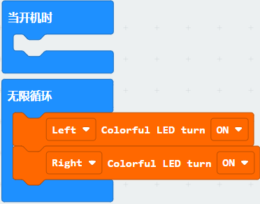
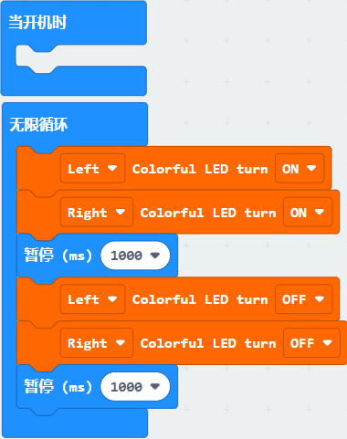

# 第13课 七彩灯闪烁

## 1.实验说明：

这是一个常用的LED，它是一个七彩LED，它采用7彩自动闪烁LED（外观白色，显示七彩）元件。七色LED模块可自动闪烁内置颜色。可以用来制作相当迷人的灯光效果。这个模块与普通LED驱动相同，当我们给它输入高电平时将自动闪烁七种颜色，而输入低电平时将停止闪烁。

我们已经将7彩LED集成到电机驱动底板，在这个项目中，我们用两个最基本的实验代码分别来控制这个七彩LED。LED模块信号端S为高电平时七彩LED开始自动闪烁，S为低电平时七彩LED熄灭不再闪烁。

## 2. 相关知识：  

                  
两个七彩灯分别通过三极管来控制，信号端分别接到了P5.4和P5.5，所以我们只要控制这两个引脚输出高低电平即可控制两个七彩灯。

## 3.实验准备：

（1）将micro：bit主板正确插入4WD Micro:bit麦克纳姆轮智能小车。 

（2）将电池装入4WD Micro:bit麦克纳姆轮智能小车。 

（3）将电机驱动底板上的电源拨码开关拨到ON一端，开启电源。 

（4）通过micro USB线连接micro:bit主板和电脑。 

（5）打开离线版本或Web版本的Makecode。

**如果选择通过导入Hex文件来加载项目，则无需手动添加MecanumRobotV2扩展库。**
如果选择手动拖动代码，则首先需要添加MecanumRobotV2扩展库（详细步骤请参考“**开发环境配置**”文件）。

## 4.添加库文件：

打开MakeCode，先点击右上角的齿轮图标（设置），再点击“扩展”。

或者单击“**高级**”上的“**扩展**”。

在搜索框中输入链接：`https://github.com/keyestudio2019/mecanum_robot_v2.git`，然后单击搜索。

单击搜索结果MecanumRobotV2以下载并安装。 该过程可能需要几秒钟。

安装完成后，你可以在左侧找到MecanumRobotV2的扩展库。

注意：添加到项目中的扩展库仅对该项目有效，而不会出现在其他项目中。 因此，当你创建新项目代码时，需要再次添加MecanumRobotV2扩展库。

## 5.实验代码1：
                                                                        
**RGB灯循环亮起7种颜色光**

可以直接加载我们提供的程序，也可以自己通过拖动程序块来编写程序程序，操作步骤如下：

**（1）寻找代码块**

**（2）完整代码程序**

## 6.实验结果1：

确定已经将电机驱动底板上的电源拨码开关拨到ON一端，按照之前的方式将代码1下载到micro：bit主板。这样，麦克纳姆车上2个七彩灯自动闪烁红、绿、蓝、青、深红、黄、白7种颜色灯光。

## 7.实验代码2：

**七彩灯1秒间断闪烁**

可以直接加载我们提供的程序，也可以自己通过拖动程序块来编写程序程序，操作步骤如下：

**（1）寻找代码块**

**（2）完整代码程序**

## 8.实验结果2：

确定已经将电机驱动底板上的电源拨码开关拨到ON一端，按照之前的方式将代码2下载到micro：bit主板。这样，麦克纳姆车上2个七彩灯闪烁1秒然后停止闪烁1秒，循环交替。

