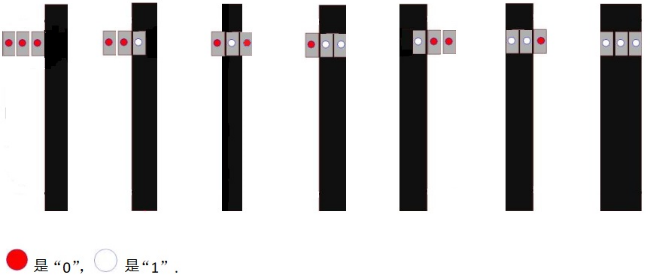
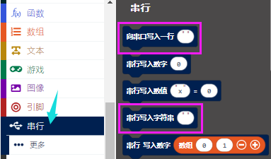
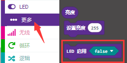
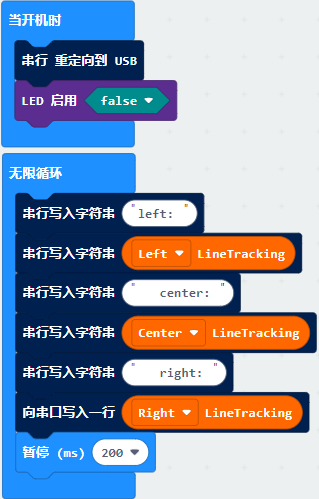
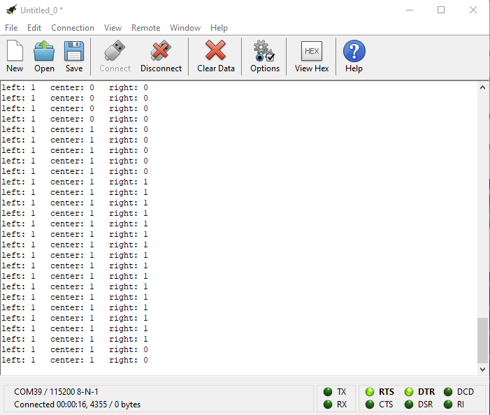

# 第17课 循迹传感器

## 1.实验说明：                                                                                 
循迹传感器实际上是红外传感器。 在小车驱动底板的前面有3路巡线，此处使用的组件是TCRT5000红外灯管。 其工作原理是利用红外光对颜色的不同反射率，然后将反射信号的强度转换为电流信号。 在检测过程中，黑色在高电平时处于活动状态，而白色在低电平时处于活动状态，即检测到黑色时或者近距离没有检测到物体时输出高电平，检测到白色或者光滑易反射光的物体时输出低电平。 检测高度为0-3厘米。 底板上方还有3个蓝色旋转电位器，通过旋转这些电位器，可以调节传感器的检测灵敏度。

## 2.相关知识：
- 工作电压: 3.3-5V (DC)
- 接口: 5PIN接口(我们接到了P10,P4,P3,3V3,G)
- 输出信号: 数字信号
- 检测高度: 0-3 cm

**红外循迹传感器：** 红外循迹传感器的红外对管分为两部分，一部分是红外发射端，另一部分是红外接收端。

黑线或黑色物体对红外线有很好的吸收效果。当红外循迹发射端向黑线发射时，发射的红外线被吸收而未形成反射信号，红外循迹接收端未接收到信号，这样红外循迹输出高电平(1);白线或白色物体对红外线没有吸收作用，红外循迹发射端的红外信号会反射回接收端，这样红外循迹输出低电平(0)。

下表给出了小车底板上的红外循迹传感器检测不同颜色物体的所有情况下的数值。其中检测到黑线、黑色物体或无物体代表1，检测到白线或白色物体代表0。

|左红外循迹传感器|中间红外循迹传感器|右红外循迹传感器|值（二进制）|
| :--: | :--: |:--:| :--: |
|0|0|0|000|
|0|0|1|001|
|0|1|0|010|
|0|1|1|011|
|1|0|0|100|
|1|0|1|101|
|1|1|0|110|
|1|1|1|111|

警告：反射式光学传感器(包括红外循迹)应避免在阳光等有红外干扰的环境中使用。阳光中含有许多不可见光，如红外线和紫外线。在强光环境下，反射式光学传感器不能正常工作。

## 3.实验准备：
（1）将micro：bit主板正确插入4WD Micro:bit麦克纳姆轮智能小车。 
（2）将电池装入4WD Micro:bit麦克纳姆轮智能小车。 
（3）将电机驱动底板上的电源拨码开关拨到ON一端，开启电源。 
（4）通过micro USB线连接micro:bit主板和电脑。 
（5）打开离线版本或Web版本的Makecode。

**如果选择通过导入Hex文件来加载项目，则无需手动添加MecanumRobotV2扩展库。**
如果选择手动拖动代码，则首先需要添加MecanumRobotV2扩展库（详细步骤请参考“**开发环境配置**”文件）。

## 4.添加库文件：
打开MakeCode，先点击右上角的齿轮图标（设置），再点击“扩展”。

或者单击“**高级**”上的“**扩展**”。

在搜索框中输入链接：`https://github.com/keyestudio2019/mecanum_robot_v2.git`，然后单击搜索。 
单击搜索结果MecanumRobotV2以下载并安装。 该过程可能需要几秒钟。

安装完成后，你可以在左侧找到MecanumRobotV2的扩展库。
 

注意：添加到项目中的扩展库仅对该项目有效，而不会出现在其他项目中。 因此，当你创建新项目代码时，需要再次添加MecanumRobotV2扩展库。

## 5.实验代码：
可以直接加载我们提供的程序，也可以自己通过拖动程序块来编写程序程序，操作步骤如下：

**（1）寻找代码块**

**（2）完整代码程序**

## 6.实验结果：                                                                                
确定已经将电机驱动底板上的电源拨码开关拨到ON一端，按照之前的方式将代码下载到micro：bit主板，Micro USB数据线不要拔下来，利用Micro USB数据线上电。

打开CoolTerm，点击Options，选择串行Port，设置COM口和波特率，波特率设置为115200（经过测试，micro:bit的USB串口通讯波特率是115200），点击OK后，最后点击Connect。这样，CoolTerm串口监视器显示出3路循迹传感器上左边，中间和右边TCRT5000红外对管读取的数字信号。如下图：

