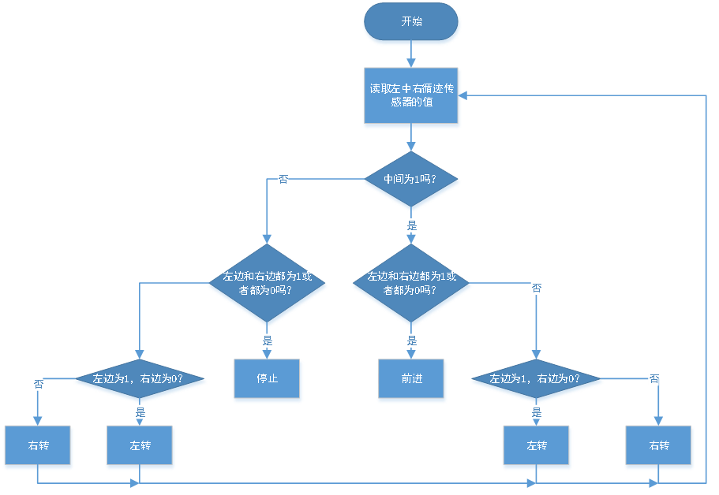
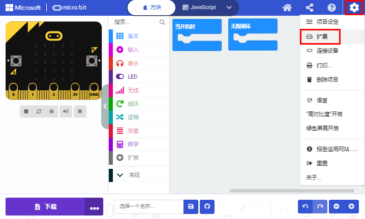
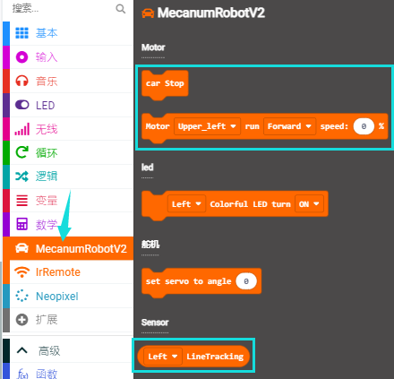
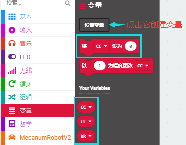
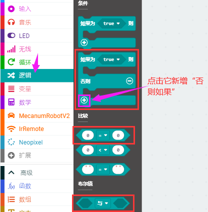
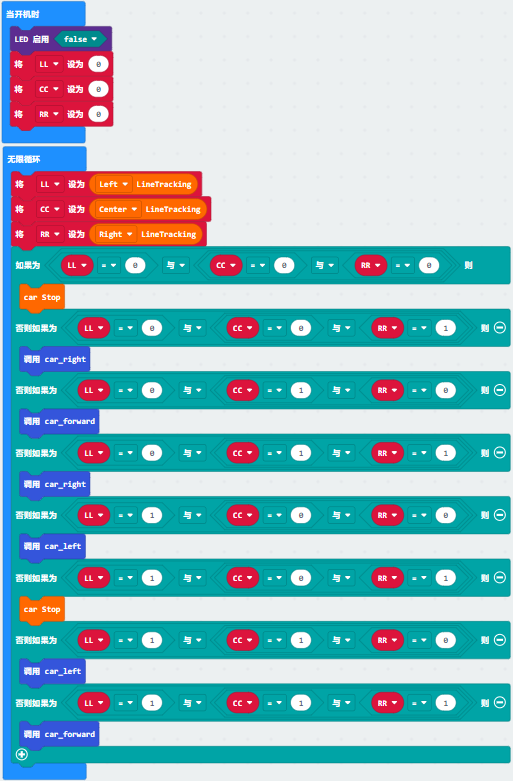
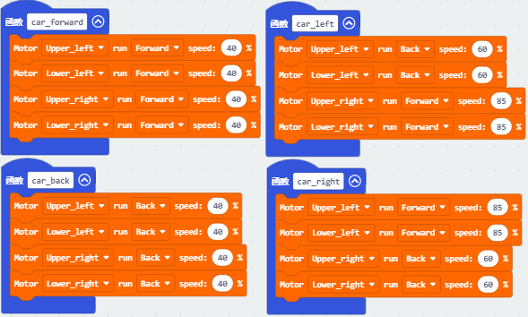

# 第18课 循迹智能车

## 1.实验说明：
前面我们学习了循迹传感器和电机驱动的原理和应用，下面我们要结合循迹传感器和电机驱动来做一款循迹小车。
循迹，意思就是循着轨迹，也就是我们经常会看到的走黑线的循迹小车，原理是利用循迹传感器对路面黑色轨迹进行检测，并将路面检测信号反馈给控制主板。控制板对采集到的信号予以分析判断，及时控制驱动电机以调整小车转向，从而使小车能够沿着黑色轨迹自动行驶，实现循迹小车自动寻迹的目的，我们来看看下面的流程图就清晰了：

## 2.实验原理：
|左红外循迹传感器|中间红外循迹传感器|右红外循迹传感器|值（二进制）|状态|
| :--: | :--: |:--:| :--: | :--: |
|0|0|0|000|停止|
|0|0|1|001|向右转|
|0|1|0|010|直走|
|0|1|1|011|向右转|
|1|0|0|100|向左转|
|1|0|1|101|停止|
|1|1|0|110|向左转|
|1|1|1|111|直走|

## 3.实验流程图：

## 4.实验准备：
（1）将micro：bit主板正确插入4WD Micro:bit麦克纳姆轮智能小车。 
（2）将电池装入4WD Micro:bit麦克纳姆轮智能小车。 
（3）将电机驱动底板上的电源拨码开关拨到ON一端，开启电源。 
（4）通过micro USB线连接micro:bit主板和电脑。 
（5）打开离线版本或Web版本的Makecode。

 警告：3路循迹传感器应避免在阳光等有红外干扰的环境中使用。阳光中含有大量的不可见光，如红外线和紫外线。在阳光强烈的环境下，3路循迹传感器不能正常工作。
 
 

**如果选择通过导入Hex文件来加载项目，则无需手动添加MecanumRobotV2扩展库。**
如果选择手动拖动代码，则首先需要添加MecanumRobotV2扩展库（详细步骤请参考“**开发环境配置**”文件）。

## 5.添加库文件：
打开MakeCode，先点击右上角的齿轮图标（设置），再点击“扩展”。

或者单击“**高级**”上的“**扩展**”。

在搜索框中输入链接：`https://github.com/keyestudio2019/mecanum_robot_v2.git`，然后单击搜索。 
单击搜索结果MecanumRobotV2以下载并安装。 该过程可能需要几秒钟。

安装完成后，你可以在左侧找到MecanumRobotV2的扩展库。
 

注意：添加到项目中的扩展库仅对该项目有效，而不会出现在其他项目中。 因此，当你创建新项目代码时，需要再次添加MecanumRobotV2扩展库。

## 6.实验代码：
可以直接加载我们提供的程序，也可以自己通过拖动程序块来编写程序程序，操作步骤如下：

**（1）寻找代码块**

**（2）完整代码程序**

## 7.实验结果：
确定已经将电机驱动底板上的电源拨码开关拨到ON一端，按照之前的方式将代码下载到micro：bit主板。这样，循迹小车能随着黑色轨迹前行。

特别注意：

（1）小车循迹轨道，黑线的宽度必须大于等于3路循迹传感器模块的宽度，小车速度尽量应调低一些。

（2）测试小车时，不要在阳光明媚的太阳底下测试。测试过程中，如果出现问题，可在暗一点的环境中测试。

