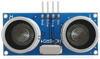
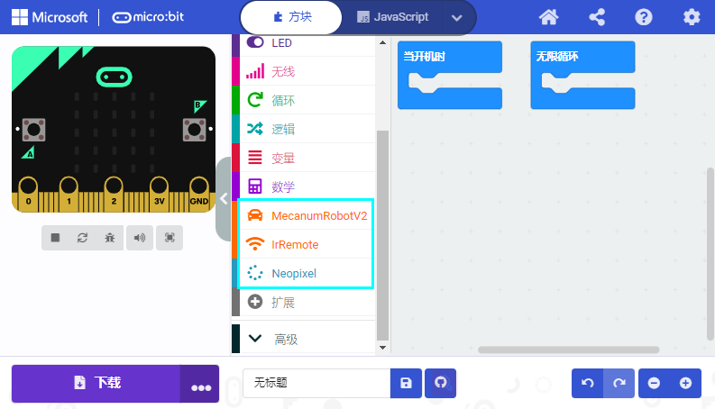
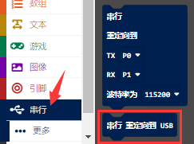
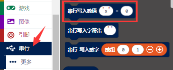
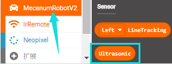
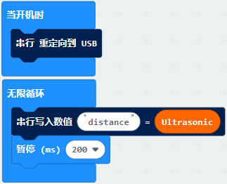
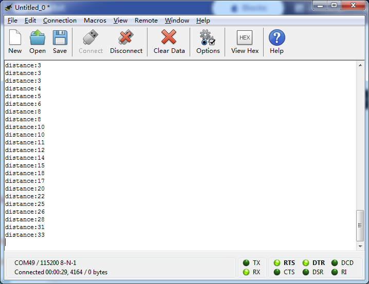

# 第19课 超声波传感器

## 1. 实验说明：

小车上有个超声波传感器，超声波传感器是一种非常实惠的距离传感器，它可以检测前方是否存在障碍物，并且检测出传感器与障碍物的详细距离。

它的原理和蝙蝠飞行的原理一样，就是超声波传感器发送出一种频率很高的超声波信号，通常正常人耳朵的听力的声波范围是20Hz~20kHz，人类无法听到。这些超声波的信号若是碰到障碍物，就会立刻反射回来，在接收到返回的信息之后，通过判断发射信号和接收信号的时间差，计算出传感器和障碍物的距离。超声波传感器主要用于各种机器人项目中的物体躲避和测距，也常被用于水位传感，甚至作为一个停车传感器。

在本实验中，我们使用超声波传感器来测量距离，并将数据打印在串口监视器上。根据前面的接线图可知，超声波传感器模块集成端口是接在电机驱动底板上5V G P15 P16集合端口，Trig（T）引脚对应的是micro:bit的P15控制的；Echo（E）引脚对应的是micro:bit的P16控制的。

## 2.元件知识：

**HC-SR04超声波传感器：** 像蝙蝠一样使用声纳来确定与物体的距离，它提供了精准的非接触范围检测，高精度和稳定的读数。它的操作不受阳光或黑色材料的影响，就像精密的照相机(在声学上像布料这样比较软的材料很难被探测到)。它带有超声波信号发射端和信号接收端。

我们看下超声波传感器模块的图片，两个像眼睛一样的东西，一个就是信号发射端（TRIG），一个就是信号接收端（ECHO）。

   

**参数：**
- 工作电压:+5V DC
- 静态电流: <2mA
- 工作电流: 15mA
- 有效角度: <15°
- 距离范围: 2cm – 400 cm
- 精度: 0.3 cm
- 测量角度: 30 degree
- 触发输入脉宽: 10us

**原理：**

最常用的超声测距的方法是回声探测法，如图：

超声波发射器向某一方向发射超声波，在发射时刻的同时计数器开始计时，超声波在空气中传播，途中碰到障碍物面阻挡就立即反射回来，超声波接收器收到反射回的超声波就立即停止计时。超声波也是一种声波，其声速V与温度有关。一般情况下超声波在空气中的传播速度为340m/s，根据计时器记录的时间t，就可以计算出发射点距障碍物面的距离s，即：s=340t/2：

(1)采用IO口TRIG触发测距，给至少10us的高电平信号;

(2)模块自动发送8个40khz的方波，自动检测是否有信号返回；

(3)有信号返回，通过ECHO输出一个高电平，单片机读取到高电平持续的时间就是超声波从发射到返回的时间。

超声波模块的电路图：

## 3.实验准备：

（1）将micro：bit主板正确插入4WD Micro:bit麦克纳姆轮智能小车。 

（2）将电池装入4WD Micro:bit麦克纳姆轮智能小车。 

（3）将电机驱动底板上的电源拨码开关拨到ON一端，开启电源。 

（4）通过micro USB线连接micro:bit主板和电脑。 

（5）打开离线版本或Web版本的Makecode。

**如果选择通过导入Hex文件来加载项目，则无需手动添加MecanumRobotV2扩展库。**
如果选择手动拖动代码，则首先需要添加MecanumRobotV2扩展库（详细步骤请参考“**开发环境配置**”文件）。

## 4.添加库文件：

打开MakeCode，先点击右上角的齿轮图标（设置），再点击“扩展”。

或者单击“**高级**”上的“**扩展**”。

在搜索框中输入链接：`https://github.com/keyestudio2019/mecanum_robot_v2.git`，然后单击搜索。

单击搜索结果MecanumRobotV2以下载并安装。 该过程可能需要几秒钟。

安装完成后，你可以在左侧找到MecanumRobotV2的扩展库。

 

注意：添加到项目中的扩展库仅对该项目有效，而不会出现在其他项目中。 因此，当你创建新项目代码时，需要再次添加MecanumRobotV2扩展库。

## 5.实验代码：

可以直接加载我们提供的程序，也可以自己通过拖动程序块来编写程序程序，操作步骤如下：

**（1）寻找代码块**

**（2）完整代码程序**

## 6.实验结果：

确定已经将电机驱动底板上的电源拨码开关拨到ON一端，按照之前的方式将代码下载到micro：bit主板，micro USB线不要从micro：bit上拔下来，利用micro USB线上电。

打开CoolTerm，点击Options，选择SerialPort，设置COM口和波特率，波特率设置为115200（经过测试，micro:bit的USB串口通讯波特率是115200），点击OK后，最后点击Connect。这样，CoolTerm串口监视器显示结果，显示如下图：

