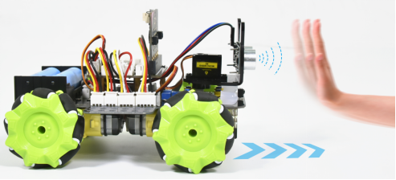
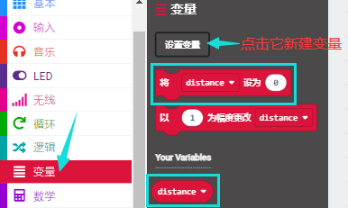
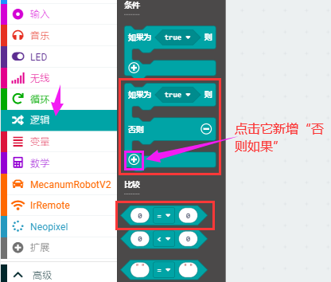
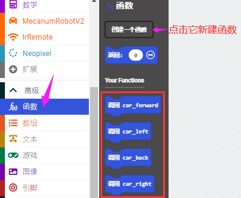
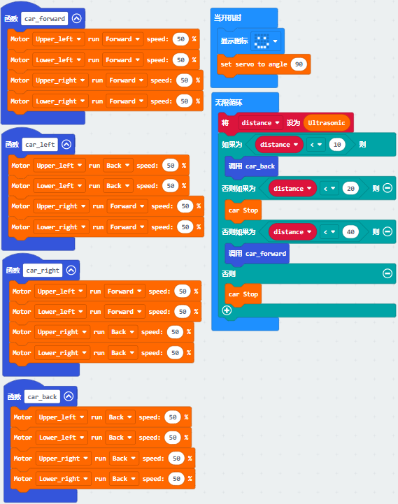

# 第20课 超声波跟随智能小车

## 1.实验说明：                                                                                
前面我们学习了使用循迹传感器和电机来制作了一个自动巡线智能小车，这节课我们使用超声波传感器和电机来制作一个自动跟随智能小车，我们通过超声波传感器检测智能车和前方障碍物的距离，然后根据这一个数据控制两个电机的转动，从而控制智能车的运动状态，我们来看看下面的程序流程图就很清晰了：

## 2.实验流程图：                                                                          

    
## 3.实验准备：

（1）将micro：bit主板正确插入4WD Micro:bit麦克纳姆轮智能小车。 

（2）将电池装入4WD Micro:bit麦克纳姆轮智能小车。 

（3）将电机驱动底板上的电源拨码开关拨到ON一端，开启电源。 

（4）通过micro USB线连接micro:bit主板和电脑。 

（5）打开离线版本或Web版本的Makecode。

**如果选择通过导入Hex文件来加载项目，则无需手动添加MecanumRobotV2扩展库。**
如果选择手动拖动代码，则首先需要添加MecanumRobotV2扩展库（详细步骤请参考“**开发环境配置**”文件）。

## 4.添加库文件：

打开MakeCode，先点击右上角的齿轮图标（设置），再点击“扩展”。

或者单击“**高级**”上的“**扩展**”。

在搜索框中输入链接：`https://github.com/keyestudio2019/mecanum_robot_v2.git`，然后单击搜索。

单击搜索结果MecanumRobotV2以下载并安装。 该过程可能需要几秒钟。

安装完成后，你可以在左侧找到MecanumRobotV2的扩展库。

 

注意：添加到项目中的扩展库仅对该项目有效，而不会出现在其他项目中。 因此，当你创建新项目代码时，需要再次添加MecanumRobotV2扩展库。

## 5.实验代码：

可以直接加载我们提供的程序，也可以自己通过拖动程序块来编写程序程序，操作步骤如下：

**（1）寻找代码块**

**（2）完整代码程序** 

## 6.实验结果：

确定已经将电机驱动底板上的电源拨码开关拨到ON一端，按照之前的方式将代码下载到micro：bit主板。这样，小车可以跟随前方障碍物的移动而移动。

注意：障碍物只能在小车的正前方移动，不能拐弯。

