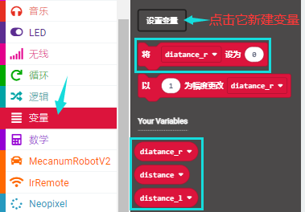
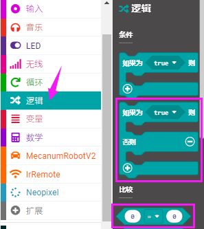
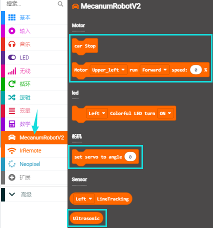
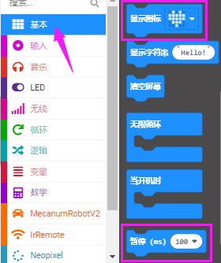
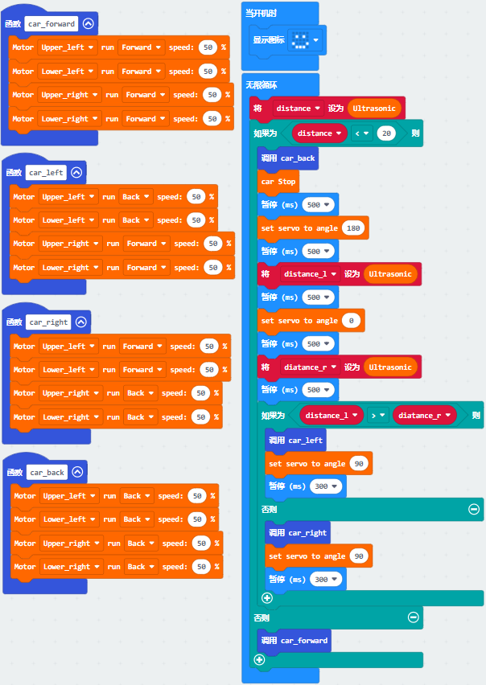

# 第21课 超声波避障智能小车

## 1.实验说明：                                                                                
在上个项目中，我们制作了一个超声波跟随智能车。实际上，利用同样的硬件，同样的接线方法，我们只需要更改一个测试代码就可以将跟随智能车变为避障智能车。超声波避障智能车，就是通过超声波传感器检测前方障碍物的距离，然后舵机云台转动检测到左右两边的距离，然后根据这一个数据控制四个电机的转动，从而控制智能车的运动状态，从而实现避障。

我们来看看下面的程序流程图就很清晰了：

## 2.实验流程图： 

## 3.实验准备：

（1）将micro：bit主板正确插入4WD Micro:bit麦克纳姆轮智能小车。 

（2）将电池装入4WD Micro:bit麦克纳姆轮智能小车。 

（3）将电机驱动底板上的电源拨码开关拨到ON一端，开启电源。 

（4）通过micro USB线连接micro:bit主板和电脑。 

（5）打开离线版本或Web版本的Makecode。

**如果选择通过导入Hex文件来加载项目，则无需手动添加MecanumRobotV2扩展库。**
如果选择手动拖动代码，则首先需要添加MecanumRobotV2扩展库（详细步骤请参考“**开发环境配置**”文件）。

## 4.添加库文件：

打开MakeCode，先点击右上角的齿轮图标（设置），再点击“扩展”。

或者单击“**高级**”上的“**扩展**”。

在搜索框中输入链接：`https://github.com/keyestudio2019/mecanum_robot_v2.git`，然后单击搜索。

单击搜索结果MecanumRobotV2以下载并安装。 该过程可能需要几秒钟。

安装完成后，你可以在左侧找到MecanumRobotV2的扩展库。

 

注意：添加到项目中的扩展库仅对该项目有效，而不会出现在其他项目中。 因此，当你创建新项目代码时，需要再次添加MecanumRobotV2扩展库。

## 5.实验代码：

可以直接加载我们提供的程序，也可以自己通过拖动程序块来编写程序程序，操作步骤如下：

**（1）寻找代码块**

**（2）完整代码程序** 

## 6.实验结果：

确定已经将电机驱动底板上的电源拨码开关拨到ON一端，按照之前的方式将代码下载到micro：bit主板。这样，Microbit 4WD麦克纳姆轮智能小车在离前方障碍物的距离大于等于20cm时，Microbit 4WD麦克纳姆轮智能小车向前走；反之，超声波先转动到左边，测得左边的距离，然后转动到右边，测得右边的距离，左边距离大于右边时，Microbit 4WD 麦克纳姆轮智能小车向左转，左边距离小于右边时，Microbit 4WD 麦克纳姆轮智能小车向右转。

