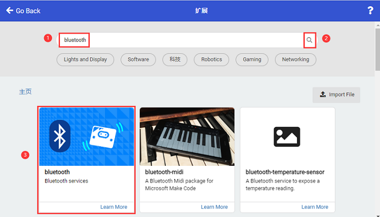
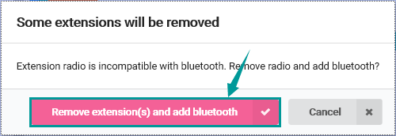
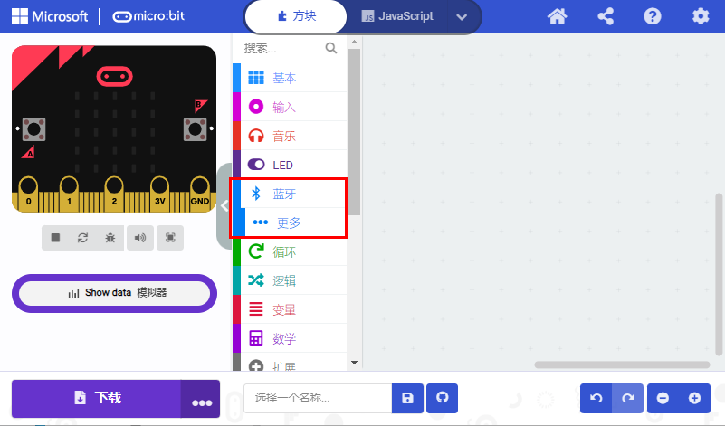
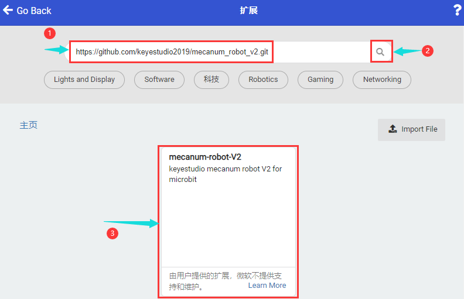

# 第25课 蓝牙APP控制智能车

## 1.实验说明：                                                                                
在上一课程中，我们已经介绍了蓝牙APP的使用和各按钮的功能，并且通过蓝牙APP连接Micro:bit上的蓝牙来读取了APP界面上各按钮发送的控制字符，在本课程中，主要是通过蓝牙APP连接Micro:bit上的蓝牙实现APP控制4WD智能车的多种功能。

## 2. 准备：                                                                                   
（1）将micro：bit主板正确插入4WD Micro:bit麦克纳姆轮智能小车。 
（2）将电池装入4WD Micro:bit麦克纳姆轮智能小车。 
（3）将电机驱动底板上的电源拨码开关拨到ON一端，开启电源。 
（4）通过micro USB线连接micro:bit主板和电脑。
（5）打开离线版本或Web版本的Makecode。 
 如果选择通过导入 .Hex文件来加载项目，则无需手动添加蓝牙扩展库。
如果选择手动拖动代码，则首先需要添加蓝牙扩展库和MecanumRobotV2扩展库（详细步骤请参考“**开发环境配置**”文件）。

## 3.添加库文件：
打开MakeCode，先点击右上角的齿轮图标（设置），再点击“扩展”。

或者单击“**高级**”上的“**扩展**”。

进入库文件选择页面，在文本框输入“**bluetooth**”并点击搜索，出现“**bluetooth**”扩展库并点击“**bluetooth**”扩展库（如果界面有，就不需要通过搜索Bluetooth来找到），如下图所示：

由于micro:bit的硬件原因，蓝牙和无线电不能同时工作，所以它们的扩展库互不兼容。安装蓝牙扩展库时，系统将提示您删除无线电扩展。只需确认移除就行。

这样，蓝牙扩展库就添加好了，接着添加MecanumRobotV2扩展库。

打开MakeCode，先点击右上角的齿轮图标（设置），再点击“扩展”。

或者单击“**高级**”上的“**扩展**”。

在搜索框中输入链接：`https://github.com/keyestudio2019/mecanum_robot_v2.git`，然后单击搜索。 
单击搜索结果MecanumRobotV2以下载并安装。 该过程可能需要几秒钟。

安装完成后，你可以在左侧找到MecanumRobotV2的扩展库。
 

注意：添加到项目中的扩展库仅对该项目有效，而不会出现在其他项目中。 因此，当你创建新项目代码时，需要再次添加MecanumRobotV2扩展库。

## 4.实验代码：                                                                                
由于这个代码程序比较复杂，步骤比较多，这里我们就不提供编写代码程序的详细操作步骤，如果你自己有兴趣的话，可以自己拖动代码块来操作下。
我们提供编写好的代码程序，请打开我们提供的示例代码“**第25课：蓝牙APP控制智能车.hex**”查看，如下图位置：

## 5.实验结果：                                                                                
（1）实验代码编完之后需要设置，先点击右上角的齿轮图标（设置），再单击“**项目设定**”，在文本框中输入“**第25课：蓝牙APP控制智能车**”后，将“**无需配对**”设置为“**打开**”状态。（如果是直接导入实验代码的就不需要此操作，而自己拖动代码块编写实验代码的就需要此操作）

（2）设置完之后，确定已经将电机驱动底板上的电源拨码开关拨到ON一端，按照之前的方式将实验代码下载到micro：bit主板。这样，下载之后打开手机/ipad应用程序mecanum_robot，然后按照前面的方法完成蓝牙连接，那你就可以操作mecanum_robot蓝牙APP页面上的按钮（控件）来控制4WD智能车自由工作，具体玩法如下：（有关APP的具体下载安装方法及使用方法，请参考**第24课 读取蓝牙数据** ）
（1）点击开启七彩灯，再次点击这个按钮七彩灯就会关闭。
（2）点击会进入循迹模式，当想退出该模式时，再次点击该按钮。
（3）点击会进入跟随模式、当想退出该模式时，再次点击该按钮。
（4）点击会进入避障模式，当想退出该模式时，再次点击该按钮。
（5）拉动这两个条幅回改变左边两个电机的速度，右边也是相同的操作方法。
注意：是用来进行调速的，当进行调速时，应该拖动拉条；不能点击，如果点击的话可能调速不成功。
（6）这几个按钮是用来切换底板下面4个2812灯珠颜色的，中间按钮为关闭功能。
（7）剩下其他的按钮全都是用来操控小车行驶的，跟其他按钮不同的是，这些按钮当我们按下时小车行驶，松开按钮时小车停止。

