## Mu Editor 编译器教程

1. 安装 IDE                                                   
**Mu**
Mu的官方网站：https://codewith.mu/
Mu是一个面向初学者程序员的Python代码编辑器，它基于教师和学生。获得Mu最简单和最容易的方法是通过Windows或Mac OSX的官方安装程序(Mu不再支持32位Windows)。目前推荐的版本是Mu 1.2.0。建议你们通过每个支持的操作系统的链接更新到这个版本.

**步骤1-确定版本并且下载Mu安装程序：**
先了解您的计算机是Windows系统还是Mac OSX系统；再打开资源管理器，鼠标右键点击”此电脑”，并选择属性，了解您的Windows系统是32位还是64位。
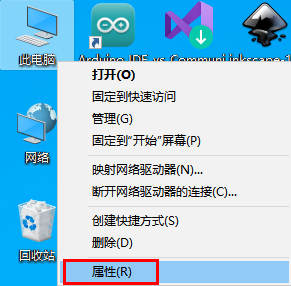

查看系统类别，类型将显示在操作系统下，64位系统或者32位系统：
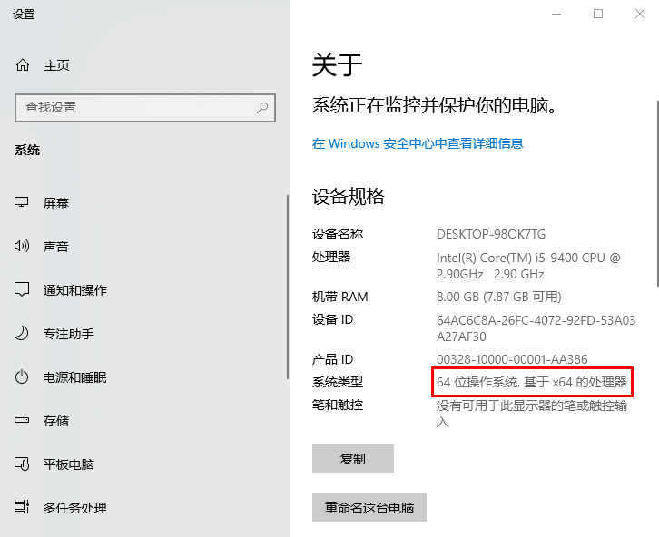
打开链接：https://codewith.mu/en/download 下载对应的Mu软件版本。

**步骤2-运行安装程序：**
找到你刚刚下载的安装程序（它可能在你的下载文件夹中），双击打开安装程序文件。

这里我们概述了在Windows 系统上安装Mu所需的步骤。
Mac OSX系统安装Mu方法对应链接：https://codewith.mu/en/howto/1.1/install_macos 。

**步骤3-许可协议**
检查许可证，选择复选框并单击“Install”。

**步骤4-安装**
当Mu在你的电脑上安装时，需要几秒钟。
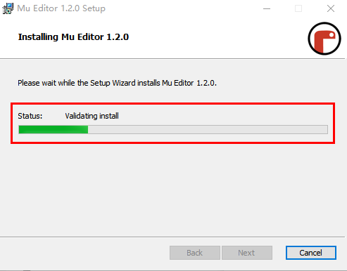

**第5步-完成**              
安装已成功完成，请单击“**Finish**”关闭安装程序。

**第6步-启动Mu**              
你可以点击开始菜单中的图标启动Mu，也可以在搜索框中输入Mu(下面两种方法都有显示)。在第一次开始时，这可能需要一些时间。

Mu的主界面如下图所示：

2. 开发板驱动安装                                              
Micro:bit是可以免安装USB驱动的。如果你的电脑识别不了Micro:bit主板，则需要安装一下Micro:bit驱动，我们提供有Micro:bit 驱动文件
和安装Micro:bit驱动说明书，你可以进入相关文件夹中根据安装说明书进行安装。

3. 编译器设置和工具栏介绍                                      

第一次使用时需要设置“模式”为BBC micro:bit。
打开Mu软件，点击菜单栏中的“模式”按钮并在弹出对话框中选择“BBC micro：bit”之后，单击“OK”。
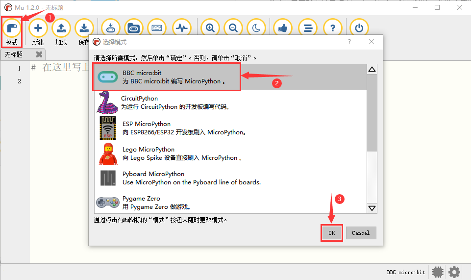

Mu的操作页面请参考官方的介绍：https://codewith.mu/en/tutorials/1.1/start

更多有关使用Mu的教程，请参阅：https://codewith.mu/en/tutorials/

4. 库文件安装                              
特别注意：导入库文件前需要给Micro:bit主板上传一个.py的代码（空代码也是可以的），这里我们是以一个空代码为例。

 
 

导入 “**keyes_mecanum_Car_V2.py**” 库文件

 

Mu保存文件的默认目录是“Mu_code”，它位于用户目录的根目录中。参考文献链接：https://codewith.mu/en/tutorials/1.0/files
例如，在Windows系统中，假设您的系统安装在电脑C驱动器上，则用户名为“Administrator”，那么“mu_code”目录的路径是“C:\Administrator\mu_ code”。在Linux系统上，“mu_code”目录的路径是“~/home/mu_code”           
进入“mu_code”文件夹。

我们提供的库文件“keyes_mecanum_Car_V2.py”的路径如下：

复制粘贴我们提供的库文件“keyes_mecanum_Car_V2.py”到“mu_code”文件夹中。复制成功后，如下图：

先打开Mu软件并连接Micro:bit主板到电脑，接着点击“**刷入**”按钮烧入一个空的程序代码到Micro:bit主板中。

然后点击“**文件**”按钮，就可以在“**电脑上的文件**”栏的下面方框中看到对应的库文件，再拖着库文件“keyes_mecanum_Car_V2.py”到Micro:bit主板中。
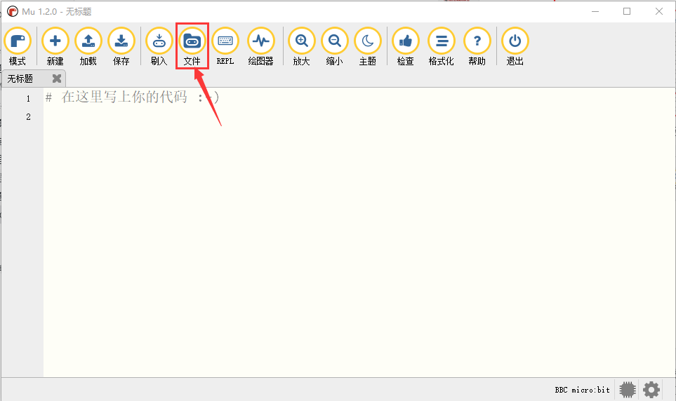
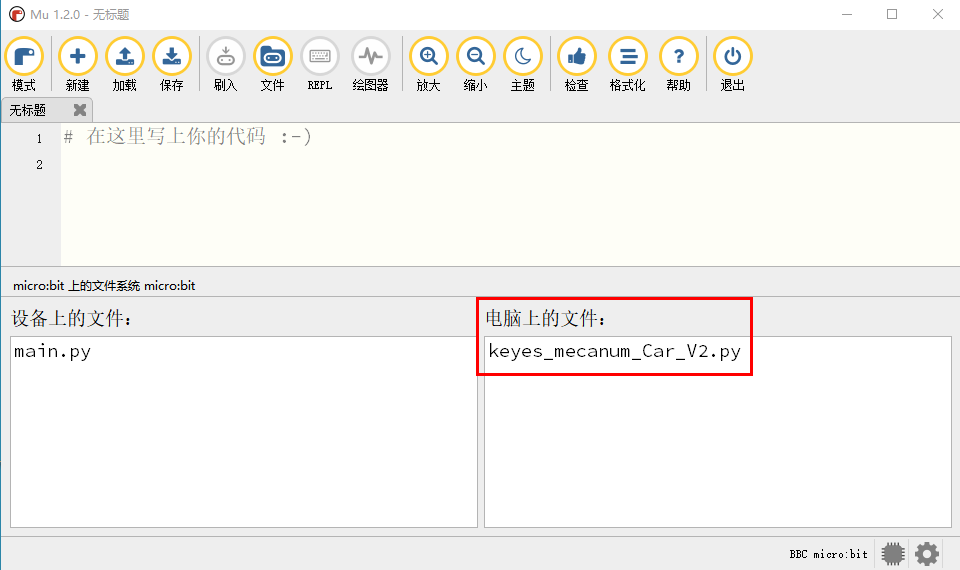
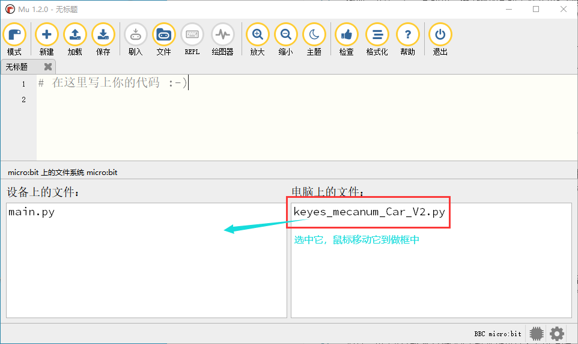
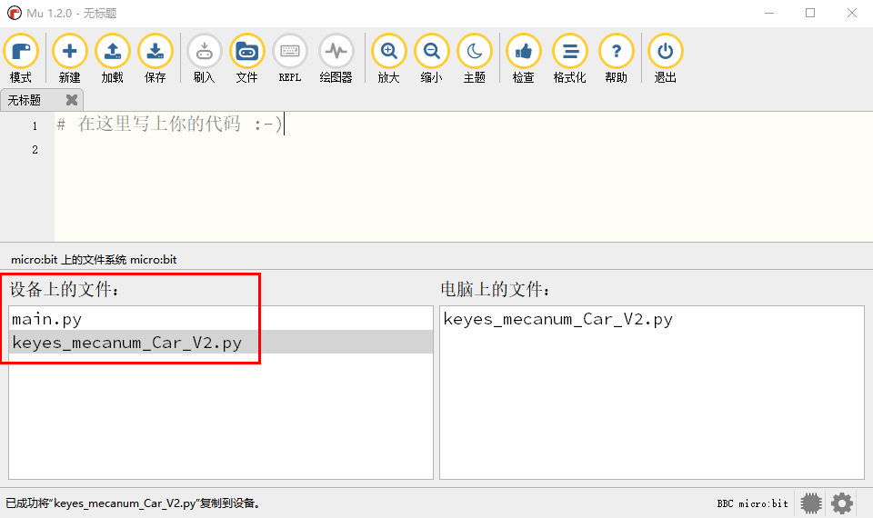
 
库文件导入成功后，你点击“**加载**”按钮导入Python教程中第13课文件夹中的程序代码“**第13课：七彩灯闪烁\.py**”,然后单击“**检查**”按钮来检查代码是否有错误。如果一行出现光标或下划线，则表明该行的程序有错误。
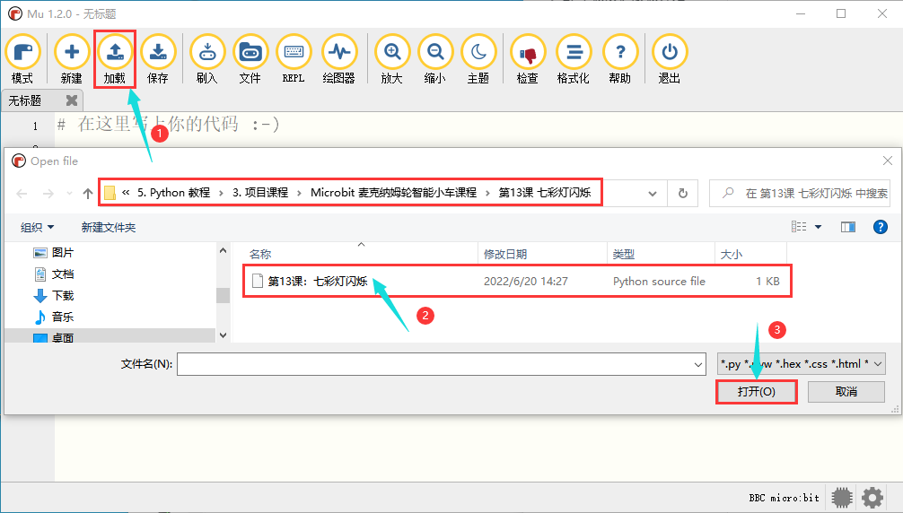

但是，单击“**检查**”按钮来检查代码是否有错误时，即使代码没有错误时也会出现如下提示语，这提示语只是一些警告语，而不是代码错误提示语。也就是说整个代码是没有错误的。

确定程序代码无误之后，你还需要确定Micro USB线已经将Micro:bit主板连接到电脑，然后单击“**刷入**”按钮将代码下载到Micro:bit主板。

如果点击“**刷入**”按钮后程序代码错误或实验现象错误，请确认你是否已经导入好我们提供给Micro:bit主板的库文件“keyes_mecanum_Car_V2.py”。

特别注意: 
如果您在micro:bit板上下载了其他程序，但库文件“keyes_mecanum_Car_V2.py”程序除外。在使用Micropython编程之前，您需要将库文件导入到Micro:bit主板。
如果您始终使用相同的 Micro:bit主板进行Micropython编程，则无需多次将库文件发送到Micro:bit主板；反之，就需要再次将库文件发送到Micro:bit主板。 

5. 添加代码到编译器                                             
这里我们以基础教程的“**第1课 心跳\.py**”为例，打开Python教程第1课的文件夹内的程序代码文件“**第1课 心跳\.py**”。

除了上述Mu软件加载（导入）代码方法之外，还有一种更简单的加载代码方法：先打开Mu软件，然后选中“**第1课 心跳\.py**”文件，并继续按下鼠标左键，将选中的文件拖动到Mu软件中。如下图所示：

成功加载如下所示。你也可以自己在编辑窗口输入代码。（注意！所有英文及符号均须以英文填写，最后一行必须有空格。）

6.下载代码到Micro:bit主板                                    

通过Micro USB线连接Micro:bit主板和电脑，点击“**刷入**”按钮将代码下载到Micro:bit主板。

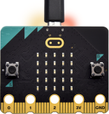

如果代码有错误，也可以将代码成功下载到Micro:bit主板，但无法正常工作。如果sleep写为sleeps，点击“**刷入**”按钮，代码也会被下载到Micro:bit主板。

但是，下载完成后，Micro:bit主板正面的led点阵提示一些错误信息，以及错误的行号。点击“**REPL**”按钮之后，再按下Micro:bit主板的重置按钮（背面的复位按钮，不是A、B按键），错误信息将显示在REPL框中，如下所示：

再次单击“**REPL**”按钮，将关闭REPL模式，然后你就可以刷新新代码了。为了确保代码正确，完成代码后，单击“**检查**”按钮检查代码是否有错误。如下图所示，点击“**检查**”按钮，然后Mu将指示代码的错误。

根据错误提示，正确修改代码。然后再点击“**检查**”按钮，Mu在下面的栏上显示没有问题。
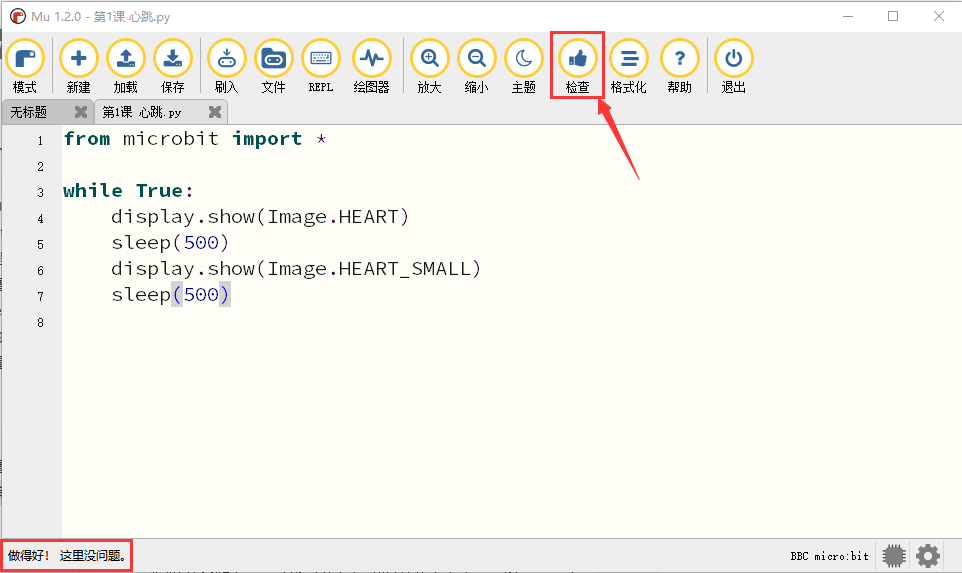
有关使用Mu的更多教程，请参阅：https://codewith.mu/en/tutorials/

7. 相关资料链接
1. BBC microbit MicroPython的官方说明链接：
https://microbit-micropython.readthedocs.io/en/latest/tutorials/introduction.html
2. MicroPython 语言的官方链接：
https://docs.openmv.io/reference/index.html
3. ustruct 库链接：
https://docs.openmv.io/library/ustruct.html
4. math 库链接：
https://docs.openmv.io/library/math.html
5. utime(sleep_us,tick_us) 库文件链接：
https://docs.openmv.io/library/utime.html#