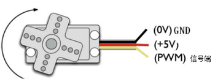

# 第15课 舵机转动

## 1.实验说明：                                                                                
在前面的4WD Microbit麦克纳姆轮智能小车安装步骤文档中，我们已经设置了舵机角度。舵机是一种可以非常精确地旋转的电机。目前已广泛应用于玩具车、遥控直升机、飞机、机器人等领域。在这个项目中，我们将来学习有关舵机转动。

## 2.元件知识： 

**舵机：** 舵机是一种位置伺服的驱动器，主要是由外壳、电路板、无核心马达、齿轮与位置检测器所构成。其工作原理是由接收机或者单片机发出信号给舵机，其内部有一个基准电路，产生周期为20ms，宽度为1.5ms 的基准信号，将获得的直流偏置电压与电位器的电压比较，获得电压差输出。经由电路板上的IC 判断转动方向，再驱动无核心马达开始转动，透过减速齿轮将动力传至摆臂，同时由位置检测器送回信号，判断是否已经到达定位。适用于那些需要角度不断变化并可以保持的控制系统。当电机转速一定时，通过级联减速齿轮带动电位器旋转，使得电压差为0，电机停止转动。
舵机有多种规格，但它们都有三根连接线，分别是棕色、红色、橙色(不同品牌可能有不同的颜色)。棕色为GND，红色为电源正极，橙色为信号线

舵机的伺服系统由可变宽度的脉冲来进行控制，橙色的控制线是用来传送脉冲的。一般而言，PWM控制舵机的基准信号周期为20ms（50Hz），理论上脉宽应在1ms到2ms之间，对应控制舵机角度是0°～180°。但是，实际上更多控制舵机的脉宽范围是0.5ms 到2.5ms，具体需要自己实际调试下。

经过实测，舵机的脉冲范围为0.65ms~2.5ms。180度舵机，对应的控制关系是这样的：
|高电平时间|舵机角度|基准信号周期时间（20ms）|
| :--: | :--: | :--: |
|0.65ms|0度|0.65ms高电平+19.35ms低电平|
|1.5ms|90度|1.5ms高电平+18.5ms低电平|
|2.5ms|180度|2.5ms高电平+17.5ms低电平|

舵机的规格参数：
|工作电压：|DC 4.8V〜6V|
| :--: | :--: |
|可操作角度范围：|可操作角度范围：|
|脉波宽度范围：|500→2500 μsec|
|外观尺寸：|22.9*12.2*30mm|
|空载转速：|0.12±0.01 sec/60度（DC 4.8V）  0.1±0.01 sec/60度（DC 6V）|
|空载电流：|200±20mA（DC 4.8V）  220±20mA（DC 6V）|
|停止扭力：|1.3±0.01kg·cm（DC 4.8V）  1.5±0.1kg·cm（DC 6V）|
|停止电流：|≦850mA（DC 4.8V）  ≦1000mA（DC 6V）|
|待机电流：|3±1mA（DC 4.8V）  4±1mA（DC 6V）|
|重量:|9±1g (不带舵机轴)|
|使用温度：|-30℃~60℃|

<span style="color: rgb(255, 76, 65);">这里要注意，不要使用电脑和USB数据线供电，因为如果电流需求大于500mA，会有烧坏舵机的可能，推荐使用电池外置供电。</span>

## 3.实验准备：
（1）将micro：bit主板正确插入4WD Micro:bit麦克纳姆轮智能小车。 
（2）将电池装入4WD Micro:bit麦克纳姆轮智能小车。 
（3）将电机驱动底板上的电源拨码开关拨到ON一端，开启电源。 
（4）通过micro USB线连接micro:bit主板和电脑。 
（5）打开离线版本的Mu软件。

## 4.实验代码：
可以直接在Mu编译器上传教程中的代码，也可以手动在Mu编译器编写代码。<span style="color: rgb(255, 0, 255);">（注意！所有英文及符号均须以英文填写，最后一行必须有空格。）</span>

<span style="color: rgb(255, 76, 65);">添加代码到Mu编译器的教程与下载代码的教程请阅读“开发环境设置”文件夹中的文件“Mu Editor 编译器教程”。</span>

```
from microbit import *

class Servo:
    def __init__(self, pin, freq=50, min_us=600, max_us=2400, angle=180):
        self.min_us = min_us
        self.max_us = max_us
        self.us = 0
        self.freq = freq
        self.angle = angle
        self.analog_period = 0
        self.pin = pin
        analog_period = round((1/self.freq) * 1000)  # hertz to miliseconds
        self.pin.set_analog_period(analog_period)

    def write_us(self, us):
        us = min(self.max_us, max(self.min_us, us))
        duty = round(us * 1024 * self.freq // 1000000)
        self.pin.write_analog(duty)
        sleep(100)
        self.pin.write_analog(0)

    def write_angle(self, degrees=None):
        if degrees is None:
            degrees = math.degrees(radians)
        degrees = degrees % 360
        total_range = self.max_us - self.min_us
        us = self.min_us + total_range * degrees // self.angle
        self.write_us(us)

Servo(pin14).write_angle(0)
sleep(1000)
display.show(Image.HAPPY)

while True:
        Servo(pin14).write_angle(0)
        sleep(1000)
        Servo(pin14).write_angle(45)
        sleep(1000)
        Servo(pin14).write_angle(90)
        sleep(1000)
        Servo(pin14).write_angle(135)
        sleep(1000)
        Servo(pin14).write_angle(180)
        sleep(1000)
```

## 5.实验结果：                                                                                
确定已经将电机驱动底板上的电源拨码开关拨到ON一端，点击“**刷入**”将代码下载到micro：bit主板。microbit主板上的LED点阵显示“笑脸”图案，并且舵机从0°~ 45°~ 90°~ 135°~ 180°~ 0°，循环进行。   


