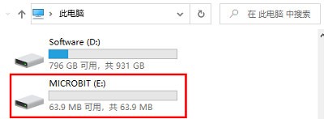
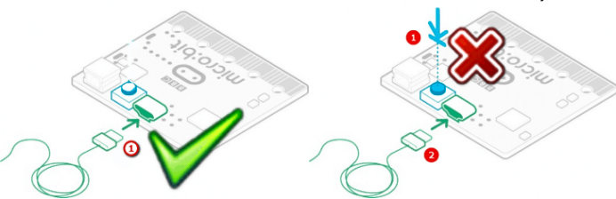

# 1. 关于Micro：bit无法下载程序，盘符显示MAINTENANCE的解决方法

**问题现象：**
很多新用户最近遇到，刚买到的Micro:bit主板插上Micro USB线连接到电脑上，点击下载，下载不进去，Micro:bit主板没有反应。
如果用户的软件操作没有问题的话，可能是自己不小心按着Micro:bit主板上的复位键进入了Micro:bit刷固件模式或者可能是自己的一些误操作导致Micro:bit主板丢失了固件。
所谓的刷固件模式：插上Micro:bit主板，显示多了一个盘符“MAINTENANCE”，进入了刷固件模式后，是无法进行正常的程序下载的。

**解决办法：**
1. 从此页面将十六进制文件下载到您的电脑。 
下载最新的micro:bit固件-0257的链接：https://www.microbit.org/get-started/user-guide/firmware/ 
（注意：你可以点击上述链接下载最新固件十六进制文件；如果你不下载，在相应的文件夹中也有我们事前下载好的最新固件-0257十六进制文件）
按照下图操作，直接将下载好的最新固件十六进制文件拖到“MAINTENANCE”，即可将Micro:bit恢复到正常模式。

**如何避免进入“MAINTENANCE”：**
1. Micro:bit主板插入Micro USB线时，不要按着Micro:bit上的复位键，再插Micro USB线，
很多新手不小心就按着Micro:bit主板上的复位键插上Micro USB线就进入了刷固件模式（新手常犯的错误）

2. 在Micro:bit程序下载过程中，不要突然拔掉，这可能导致固件丢失，Micro:bit主板就会进入刷固件模式了。
3. 在实验过程中，接线接错，导致短路，也有可能导致Micro:bit主板固件丢失，新手操作一定要注意。

