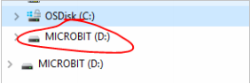
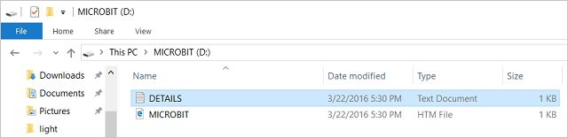
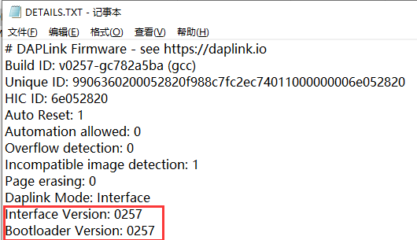
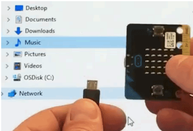

# 2. 使用WebUSB对下载进行故障排除

Micro:bit主板与WebUSB（/ device / usb / webusb）配对时遇到问题？让我们尝试找出原因。

步骤 1: 检查你的线 
确保使用Micro USB线将Micro:bit主板连接到电脑。 连接后，您应该会在Windows资源管理器中看到一个MICROBIT 驱动器。 

如果可以看到MICROBIT驱动器，请转到步骤2。如果看不到该驱动器，请执行以下操作： 
● 确保Micro USB线正常工作。
Micro USB线是否在另一台电脑上工作？如果不是，请查找其他Micro USB线。 某些Micro USB线可能仅提供电源连接，实际上并未传输数据。 
● 在电脑上尝试另一个USB端口。 
电缆是否正常，但是您仍然看不到MICROBIT 驱动器？ 嗯，您的Micro:bit可能有问题。 尝试在Micro:bit.org上的故障查找页面中（https://support.microbit.org/support/solutions/articles/19000024000-fault-finding-with-a-micro-bit ）描述的其他步骤。如果这样做没有帮助，您可以创建支持通知单（https://support.microbit.org/support/tickets/new ）将问题通知Micro:bit基金会。 跳过其余步骤。

步骤 2: 检查您的固件版本 
Micro:bit主板上的固件版本可能需要更新。让我们检查： 
1. 找到MICROBIT 驱动 
2. 打开DETAILS.TXT 文件

在文件中查找说明版本号的行。 Version: ... 

如果版本为0234、0241、0243，则需要更新固件（/设备/固件）在您的Micro:bit主板上。 转到步骤3，然后按照升级说明进行操作。 
如果版本是0249、0250或更高版本，则您具有正确的固件，请转到步骤4。

步骤 3: 升级固件 
1.将您的Micro:bit进入维护模式。 为此，请从Micro:bit主板拔下Micro USB线，然后在按住复位按钮的同时重新连接Micro USB线。 插入Micro USB线后，可以释放复位按钮。 现在，您应该像以前一样看到一个MAINTENANCE驱动器，而不是MICROBIT驱动器。 同样，黄色的LED指示灯将在重置按钮旁边保持点亮。 

2. 下载 firmware .hex file 
(https://microbit.org/guide/firmware/)
3.将该文件拖放到 MAINTENANCE驱动器上。
4.复制HEX文件时，黄色LED指示灯将闪烁。 复制完成后，LED会熄灭，并且micro：bit主板会重置。 现在，MAINTENANCE驱动器会变回MICROBIT。 
5.升级完成！ 您可以打开DETAILS.TXT 文件进行检查并查看固件版本已更改为与您复制的HEX文件的版本相匹配。
 如果您想了解有关连接板，维护模式和升级固件的更多信息，请在固件指南请在固件指南（https://microbit.org/guide/firmware/ ）中进行阅读。

步骤 4: 检查您的浏览器版本 
WebUSB是一项相当新的功能，可能需要您更新浏览器。 检查您的浏览器版本是否符合以下条件之一： 
● 适用于Android，Chrome操作系统，Linux，macOS和Windows 10的Chrome 65+。 
步骤 5: 配对装置 
更新固件后，打开Chrome浏览器，转到编辑器，然后点击齿轮菜单中的“配对设备”。 有关配对说明，请参见WebUSB（/ device / usb / webusb）。 
享受快速下载！ 

