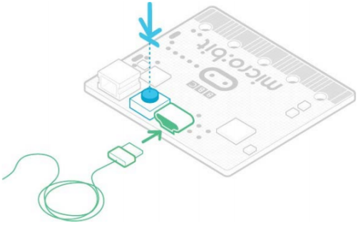

# 3. 如何更新Micro：bit的固件

**什么是Micro:bit固件?**
固件是使设备正常运行的一种特殊软件。 您可以将其视为使机器按其行为方式运行的软件。 
Micro:bit主板的背面有两个芯片。 其中一个运行您的代码，而另一个运行固件以使您能够对设备进行编程。 
Micro:bit主板可以与随附的固件一起使用，因此，如果您不需要对其进行更新，请回到我们的Micro：bit功能指南。 
有时您可能需要更新固件以测试新的软件功能。 如果是这种情况，此页面将向您显示操作方法。
**如何找出当前的固件版本** 
升级之前，您需要找出Micro：bit主板上的固件版本。通过Micro USB线将其插入，从MICROBIT驱动器中打开DETAILS.TXT文件，并在以“接口版本”开头的行上查找编号。 

```
# DAPLink Firmware - see https://daplink.io
Build ID: v0257-gc782a5ba (gcc)
Unique ID: 9906360200052820f988c7fc2ec74011000000006e052820
HIC ID: 6e052820
Auto Reset: 1
Automation allowed: 0
Overflow detection: 0
Incompatible image detection: 1
Page erasing: 0
Daplink Mode: Interface
Interface Version: 0257
Bootloader Version: 0257
Git SHA: c782a5ba907377658bc28aa8d132a0fa44543687
Local Mods: 0
USB Interfaces: MSD, CDC, HID, WebUSB
Bootloader CRC: 0x725bea7d
Interface CRC: 0xe561f1de
Remount count: 0
URL: https://microbit.org/device/?id=9906&v=0257
URL: https://microbit.org/device/?id=9904&v=0254
```
**如何更新固件** 
1.从此页面将十六进制文件下载到您的电脑。 
下载最新的Micro:bit 2.2固件-0257的链接：https://www.microbit.org/get-started/user-guide/firmware/
（<span style="color: rgb(255, 76, 65);">注意：你可以点击上述链接下载最新固件-0257十六进制文件；如果你不下载，在相应的文件夹中也有我们事前下载好的最新固件-0257十六进制文件</span>）
2.然后，在卸下电池组并将Micro USB线连接到电脑的情况下，按住Micro:bit主板背面的重置按钮， 
然后将Micro USB线插入设备。 您应该看到一个名为MAINTENANCE的驱动器出现在文件管理器中。

3. 将您从该页面下载的.HEX拖放到Micro:bit主板上，然后等待设备背面的黄色系统LED停止闪烁。 升级完成后，Micro:bit主板将重置，从计算机中弹出并以正常MICROBIT驱动器模式重新出现。 
4. 最后，检查MICROBIT驱动器上的DETAILS.TXT文件，并确保它具有与您刚下载并刷新到接口芯片的.HEX固件相同的版本号。 
先前的固件版本 
如果出于任何原因希望用回原来的固件，可以下载以前的版本。


